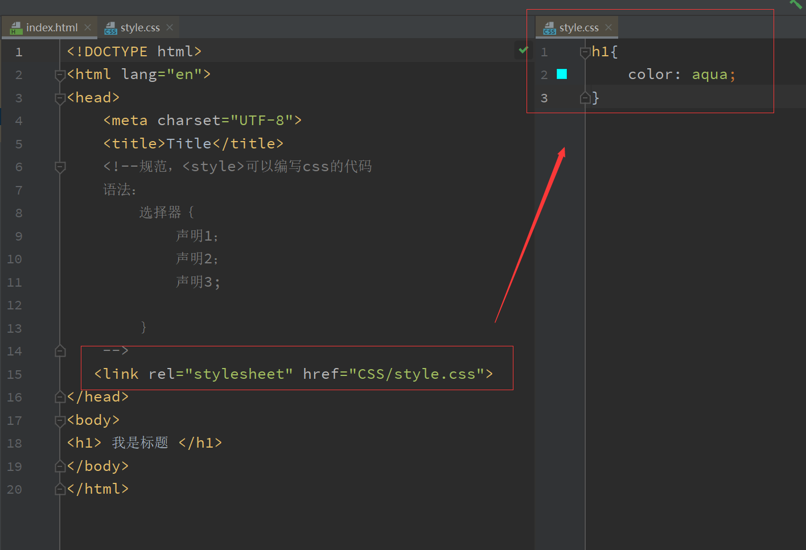
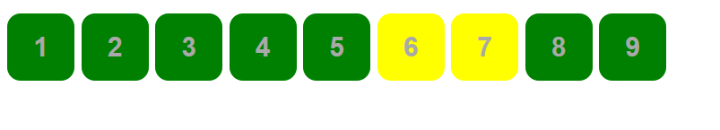
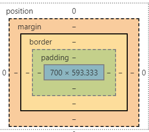
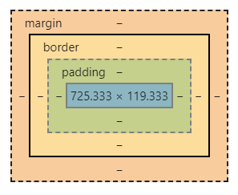
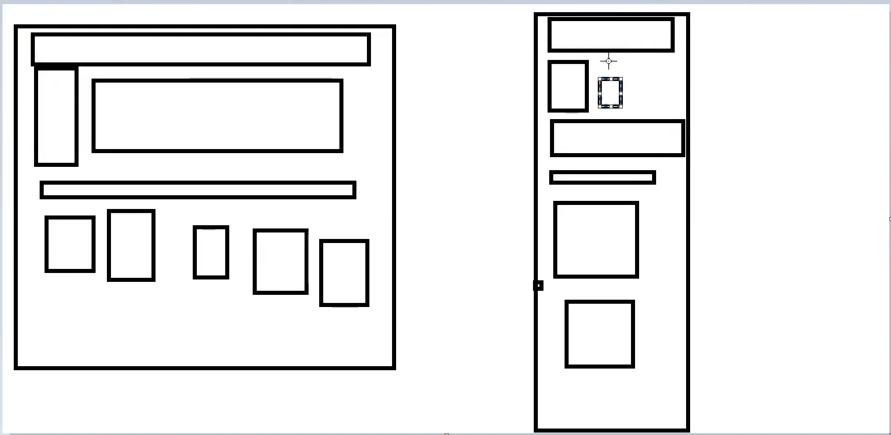
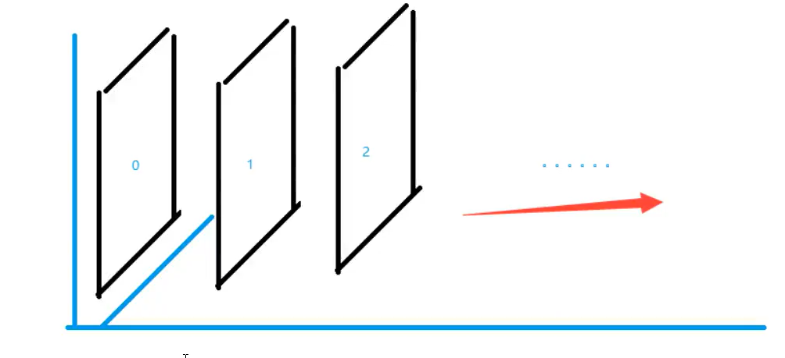

# 1.什么是CSS

## 1.1、什么是CSS

Csscading Style Sheet 层叠级联样式表

CSS：表现（美化网页）

字体 、颜色、边距、高度、宽度、背景图片、网页定位、网页浮动···

## 1.2、发展史

CSS 1.0

CSS 2.0  DiV (块) +CSS，HTML与CSS结构分离的思想，   网页变得简单 、seo

CSS 2.1  浮动 定位

CSS 3.0  圆角 阴影，动画···


## 1.3 、快速入门


```html
<!DOCTYPE html>
<html lang="en">
<head>
    <meta charset="UTF-8">
    <title>Title</title>
    <!--规范，<style>可以编写css的代码
    语法：
        选择器｛
            声明1；
            声明2；
            声明3;

        ｝
    -->
   <style>
   		h1{
   		 color: aqua;
	}
   </style>
</head>
<body>
<h1> 我是标题 </h1>
</body>
</html>
```

建议用链接方式





CSS的优势

1. 内容和表现分离
2. 网页结构表现统一，可以实现复用
3. 样式十分丰富
4. 建议使用独立于HTML的CSS文件
5. 利用SEO，容易被搜索引擎收录


### 1.4 、CSS的四种导入方式

```html
<!DOCTYPE html>
<html lang="en">
<head>
    <meta charset="UTF-8">
    <title>Title</title>


<!--内部样式-->
    <style>
        h1{
            color: green;
        }

    </style>
    <!--外部样式-->
    <link rek="stylesheet" href="css/style.css">
</head>
<body>
<!--优先级，就近原则-->
<!--行内样式：在标签元素中，编写一个Style属性，编写样式即可-->
<h1 style="color:red">我是标题</h1>


</body>
</html>
```

拓展 ： 外部样式两种写法

- 链接式

  ```html
  <!--外部样式-->
      <link rek="stylesheet" href="css/style.css">
  ```

  

- 导入式-不推荐

  css 2.1特有的

```html
<!--导入式-->
   <style>
       @import url("css/style.css");
   </style>
```

> 注意

就结论而言，强烈建议使用`link`标签，慎用`@import`方式。
 这样可以避免考虑`@import`的语法规则和注意事项，避免产生资源文件下载顺序混乱和http请求过多的烦恼。

#### 区别

**1.从属关系区别**
 `@import`是 CSS 提供的语法规则，只有导入样式表的作用；`link`是HTML提供的标签，不仅可以加载 CSS 文件，还可以定义 RSS、rel 连接属性等。

**2.加载顺序区别**
 加载页面时，`link`标签引入的 CSS 被同时加载；`@import`引入的 CSS 将在页面加载完毕后被加载。

**3.兼容性区别**
 `@import`是 CSS2.1 才有的语法，故只可在 IE5+ 才能识别；`link`标签作为 HTML 元素，不存在兼容性问题。

**4.DOM可控性区别**
 可以通过 JS 操作 DOM ，插入`link`标签来改变样式；由于 DOM 方法是基于文档的，无法使用`@import`的方式插入样式。

**5.权重区别(该项有争议，下文将详解)**
 `link`引入的样式权重大于`@import`引入的样式。


# 2.选择器

> 作用：选择页面上的某一个或者某一类元素


## 2.1、基本选择器

1. 标签选择器 ：选择一类标签 标签｛｝

   ```html
   <!DOCTYPE html>
   <html lang="en">
   <head>
       <meta charset="UTF-8">
       <title>Title</title>
       <style>
           h1{
               color: green;
           }
           P{
               color: red;
           }
       </style>
   
   </head>
   <body>
   
   <h1>hao</h1>
   <p>so</p>
   </body>
   </html>
   ```

   

2. 类选择器 class：选中所有class属性一致的标签，跨标签 .类名｛｝

   ```html
   
   <!DOCTYPE html>
   <html lang="en">
   <head>
       <meta charset="UTF-8">
       <title>Title</title>
       <style>
       /*类选择器的格式 .class的名称｛｝
       好处，可以多个标签归类，是同一个class，可以复用
   
       */
       .hao{
           color: green;
   
       }
       .li{
           color: red;
   
       }
   
       </style>
   
   </head>
   <body>
   
   
   <h1 class="hao">标题1</h1>
   <h1 class="li">标题2</h1>
   <h1 class="hao">标题3</h1>
   <p class="hao">p标签</p>
   </body>
   </html>
   ```

   

3. ID选择器：全局唯一 #id名{}

   ```html
   
   <!DOCTYPE html>
   <html lang="en">
   <head>
       <meta charset="UTF-8">
       <title>Title</title>
      <style>
          /* id选择器 :id全局唯一
           #id名称{}
           不遵循就近原则，固定的
           id选择器> class选择器> 标签选择器
           */
          #hao{
              color: green;
          }
          .style1{
              color: red;
          }
      </style>
   
   
   </head>
   <body>
   <h1 id="hao">标题1</h1>
   <h1 class="style1">标题2</h1>
   <h1 class="style1">标题3</h1>
   <h1 id="liu">标题4</h1>
   </body>
   </html>
   ```

   > 优先级 id选择器> class选择器> 标签选择器

   

## 2.2、层次选择器

1. 后代选择器 ：在某个元素的后面  祖爷爷  爷爷  爸爸 儿子

   ```css
   /*后代选择器*/
   body p{
       background: red;
   }
   ```

   

2. 子选择器，一代 儿子

   ```css
   /*子选择器*/
   body>p{
       background: aqua;
   }
   ```

   

3. 相邻兄弟选择器 同辈

   ```css
   /*相邻兄弟选择器：只有一个，相邻（向下）*/
   .active+p{
       background: blue;
   
   }
   ```

   

4. 通用选择器

   ```css
   /* 通用兄弟选择器，当前向下元素的所有兄弟*/
   .active~p{
       background: brown;
   }
   
   ```

   

## 2.3、结构伪类选择器

伪类： 条件 

```css
/*ul的第一个子元素*/

ul li:first-child{
  background: brown;
}

/*ul的最后一个子元素*/
ul li:last-child{
  background: brown;
}

/* 只选中p1：定位到父元素，选择当前的第一个元素
选择当前p元素的父级元素，选中父级元素的第一个，并且是当前元素才生效！*/
p:nth-child(1){
  background: green;
}

/*选中父元素下的p元素的第二个*/
p:nth-of-type(2){
  background: blue;
}

```


## 2.4、属性选择器（常用）

id + class 结合

``` html
<!DOCTYPE html>
<html lang="en">
  <head>
    <meta charset="UTF-8">
    <title>Title</title>

    <style>
      .demo a{
        float: left;
        display: block;
        height: 50px;
        width: 50px;
        border-radius: 10px;
        background: green;
        text-align: center;
        text-decoration: none;
        color: darkgray;
        margin-right:5px;
        font:bold 20px/50px Arial;
      }
      /*属性名，属性名 = 属性值（正则）
      = 绝对等于
      *= 包含这个元素
      ^=以这个开头
      $=以这个结尾
      */
      /*存在id属性的元素a[]{}*/

      /*id=firsr的元素*/
      /*a[id=first]{*/
      /*    background: yellow;*/

      /*}*/
      /*class中有links的元素 */
      /*a[class*="links"]{*/
      /*    background: yellow;*/
      /*}*/

      /*选中href中以http开头的元素*/
      /*a[href^=http]{*/
      /*    background: yellow;*/
      /*}*/
      /*选中以$结尾的元素*/
      a[href$=pdf]{
        background: yellow;
      }


    </style>
  </head>
  <body>

    <p class="demo">
      <a href="http://www.baidu.com" class="links item first" id="first">1</a>
      <a href="" class="links item active" target="_blank">2</a>
      <a href="image/123.html"class="links item">3</a>
      <a href="image/123.png" class="links item">4</a>
      <a href="abc" class="links item">5</a>
      <a href="/a.pdf" class="links item">6</a>
      <a href="/abc.pdf"class="links item">7</a>
      <a href="abc.doc" class="links item">8</a>
      <a href="abcd.doc" class="links item last">9</a>

    </p>
  </body>
</html>

```




```
=
*=
^=
$=
```


# 3.美化网页元素

## 3.1、为什么要美化网页

1. 有效传递页面信息
2. 美化网页，页面漂亮，才能吸引用户
3. 凸显页面主题
4. 提高用户体验

span便签: 重点要突出的字，使用span标签

``` html
<!DOCTYPE html>
<html lang="en">
  <head>
    <meta charset="UTF-8">
    <title>Title</title>
    <style>
      #title1{
        font-size: 50px;

      }
    </style>
  </head>
  <body>

    欢迎学习 <span id="title1">java</span>
  </body>
</html>
```


## 3.2、字体样式

```html
<!--
font-family:字体
font-size: 字体大小
font-weight:字体粗细
color :字体颜色

-->
<style>

  body{
    font-family:"Arial Black" 楷体;
    color: brown;
  }
  h1{
    font-size: 50px;
  }
  .p1{
    font-weight: bold;
  }
</style>
```


## 3.3、文本样式

1. 颜色 color rgb rgba
2. **文本对齐方式  text-align = center**
3. **首行缩进 text-indent:2em**
4. **行高 line-height: 单行文字上下居中  line-height=height**
5. 装饰  text-decoration
6. 文本水平对齐：vertical-align:middle


## 3.4、阴影

```css
/*text-shadow:阴影颜色，水平偏移，垂直偏移，阴影半径*/
#price{
  text-shadow:#blue 10px -10px 2px;
}

```


## 3.5、超链接伪类

正常情况下，a, a:hover

```css
/*默认的颜色*/
a{
text-decoration: none;
color: blue;
}
/*鼠标悬浮的颜色只需要记住hover*/
a:hover{
color: yellow;
font-size: 50px;

}
/*鼠标按住未释放*/
a:active{
color: brown;
}
```

## 3.6、列表

```css
/*ul li*/
/*
list-style:
    none:去掉圆点
    circle：空心圆
    decimal:数字
    squar:正方形
*/

/*ul{*/
/*    background: gray;*/
/*}*/

ul li{
    height: 30px;
    list-style: none;
    text-indent: 1em;
}

```

## 3.7、背景


背景颜色

背景图片

```css
<style>
div{
  width: 500px;
  height: 300px;
  border:1px solid red;
  background-image:url("images/2.png") ;
}
.div1{
  background-repeat: repeat-x;
}

.div2{
  background-repeat: repeat-y;
}
.div3{
  background-repeat: no-repeat;
}
</style>
```

## 3.8、渐变


```css
background-color: #4158D0;
background-image: linear-gradient(43deg, #4158D0 0%, #C850C0 46%, #FFCC70 100%);

```

# 4.盒子模型

## 4.1、什么是盒子



margin:外边距

padding：内边距

border:边框


## 4.2、边框

1. 边框的粗细
2. 边框的样式
3. 边框的颜色


```css
h1,ul,li,a,body{
  margin:0;
  padding:0;
  text-decoration: none;
}
#box{
  width: 300px;
  border:1px solid red;
}
h2{
  background: aqua;
  font-size: 16px;
  line-height: 30px;
  margin: 0;
}
form{
  background: #1dd2bd;
}
div:nth-of-type(2) input{
  border: 3px solid #56aa88;
}
```


## 4.3、内外边距


```html
<!DOCTYPE html>
<html lang="en">
  <head>
    <meta charset="UTF-8">
    <title>Title</title>
    <!--
外边距的妙用：居中元素
margin:0
-->
    <style>
      h1,ul,li,a,body{
        margin:0;
        padding:0;
        text-decoration: none;
      }
      #box{
        width: 300px;
        border:1px solid red;
      }
      /*顺时针旋转
      margin: 0 1px 2px 3px
      */

      h2{
        background: aqua;
        font-size: 16px;
        line-height: 30px;
        margin: 0;
      }
      form{
        background: #1dd2bd;
      }
      div:nth-of-type(2) input{
        border: 3px solid #56aa88;
        padding:10px;
      }

    </style>
  </head>
  <body>

    <div id="box">
      <h2>会员登录</h2>
      <form action="#">
        <div>
          <span>用户名:</span>
          <input type="text">
        </div>
        <div>
          <span>密码:</span>
          <input type="text">
        </div>
        <div>
          <span>邮箱:</span>
          <input type="text">
        </div>

      </form>


    </div>

  </body>
</html>
```


盒子的计算方式：你这个元素究竟有多大？



margin+border+padding+内容宽度

## 4.4、圆角边框

4个角

```html
<style>
  div{
    width:100px;
    height: 100px;
    border:10px solid red;
    border-radius: 100px;
  }
</style>
```


## 4.5、盒子阴影


```css
div{
  width:100px;
  height: 100px;
  border:10px solid red;
  border-radius: 60px;
  margin: 0 auto;
  box-shadow: 10px 10px 60px yellow;
}
```


# 5.浮动

## 5.1、标准文档流



块级元素：独占一行

```html
h1-h6 p div 列表···
```


行内元素：不独占一行

```html
span a img strong···
```

行内元素可以被包含在块级元素中，反之不可以

## 5.2、display

```css

<!--
block 块元素
inline 行内元素
inline-block 是块元素，但是可以内联，在一行
none 消失
-->
<style>

div{
  width: 100px;
  height: 100px;
  border: 1px solid red;
  display: inline;
}
span{
  width: 100px;
  height: 100px;
  border: 1px solid red;
  display: inline-block;
}
</style>
```

这个也是一种实现行内元素排列的方式，但是我们很多情况情况都是用float


## 5.3、float

1、左右浮动 float

```css
div{
  margin:10px;
  padding:10px;
}
.layer1{
  float:right;
}

.layer2{
  float:left;
}
```


## 5.4 、父级边框塌陷的问题

> 解决方案

1.增加父级元素的高度

```CSS
#father{
  border:1px #000 solid;
  height: 800px;
}
```


2.增加一个空的div标签，清除浮动

```css
<div class="clear"></div>
.clear{
  clear: both;
  margin: 0;
  padding: 0;
}
```


3.overflow

```css
在父级元素中增加一个 overflow：hidden;
```


4、父类增加一个伪类

```css
#father:after{
  content: '';
  dispaly: block;
  clear:both;
}
```


小结：

 1. 浮动元素后面增加空div

  -  简单，代码中尽量避免空div

2. 设置父元素高度

   简单，元素假设有了固定的高度，就会被限制

3. overflow

   简单，下拉的一些场景，避免使用

4. 父类添加一个伪类：after(**推荐**)


## 5.5、对比

- display

  方向不可以控制

- float

  浮动起来的话会脱离标准文档流，所以要解决父级边框塌陷的问题

# 6.定位

## 6.1、相对定位

```css

<!--相对定位
相对于自己原来的位置进行偏移
-->
<style>
body{
  padding: 20px;
}
div{
  margin: 10px;
  padding: 5px;
  font-size: 12px;
  line-height: 25px;
}
#father{
  border: 1px solid red;
}
#first{
  background: green;
  border: 1px dashed blue;
  position: relative; /*相对定位*/
  top: -20px;
  left: 20px
}
#second{
  background: aqua;
  border: 1px dashed blue;
}
#third{
  background: green;
  border: 1px dashed blue;
  position: relative;
  bottom: 10px;
  right: 20px;
}
</style>
```

相对定位：positionl: relative;

相对于原来的位置，进行指定的偏移,相对定位仍然在标准文档流中，原来的位置会被保留

```
top: -20px;
left: 20px;
bottom: -10px;
right: 20px;
```


## 6.2、绝对定位

定位：基于xxx定位，上下左右

1. 没有父级元素定位的前提下，相对于浏览器定位
2. 假设父级元素存在定位，我们通常会相对于父级元素进行偏移
3. 在父级元素范围内移动，相对于父级或浏览器的位置，进行指定的偏移，绝对定位的话，它不在标准文档流中，原来的位置不会被保留。

```html
<!DOCTYPE html>
<html lang="en">
<head>
    <meta charset="UTF-8">
    <title>Title</title>

    
    <style>
        body{
            padding: 20px;
        }
        div{
            margin: 10px;
            padding: 5px;
            font-size: 12px;
            line-height: 25px;
        }
        #father{
            border: 1px solid red;
        }
        #first{
            background: green;
            border: 1px dashed blue;

        }
        #second{
            background: aqua;
            border: 1px dashed blue;
            position: absolute;
            right: 30px;
        }
        #third{
            background: green;
            border: 1px dashed blue;

        }
    </style>
</head>
<body>

<div id="father">
    <div id="first">1</div>
    <div id="second">2</div>
    <div id="third">3</div>
</div>

</body>
</html>

```

## 6.3、固定定位

```html
<!DOCTYPE html>
<html lang="en">
  <head>
    <meta charset="UTF-8">
    <title>Title</title>

    <style>
      body{
        height: 1000px;

      }
      div:nth-of-type(1){  /*绝对定位：相对于浏览器*/
        width:100px;
        height: 100px;
        background: green;
        position: absolute;
        right: 0;
        bottom: 0;

      }

      div:nth-of-type(2){/*fixed,固定定位*/
        width:50px;
        height: 50px;
        background: yellow;
        position: fixed;
        right: 0;
        bottom: 0;

      }
    </style>
  </head>
  <body>

    <div>div1</div>
    <div>div2</div>

  </body>
</html>
```


## 6.4、z-index



图层~

z-index默认为0，最高999

```html
<!DOCTYPE html>
<html lang="en">
<head>
    <meta charset="UTF-8">
    <title>Title</title>
    <link rel="stylesheet" href="css/style.css">
</head>
<body>

<div id="content">
    <ul>
        <li>
        <li class="tipText">冷兔宝宝</li>
        <li class="tipBg"></li>
        <li>时间： 2020-01-01</li>
        <li>地点；天津</li>
    </ul>
</div>

</body>
</html>
```


 opacity: 0.1; /*背景透明度*/

```css
#content{
  width: 350px;
  padding:0px;
  margin: 0px;
  overflow: hidden;
  font-size: 12px;
  line-height:25px;
  border: 1px solid red;

}

ui,li{
  padding: 0px;
  margin: 0px;
  list-style: none;
}

/*父级元素相对定位*/

#content ul{
  position: relative;
}

.tipText, .tipBg{
  position: absolute;
  width: 380px;
  height: 25px;
  top: 220px;
}
.tipText{
  color: green;
  /*z-index: 0;*/
}
.tipBg{
  background: black;
  opacity: 0.1; /*背景透明度*/
}
```

