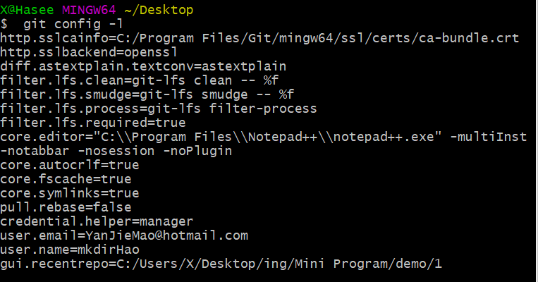
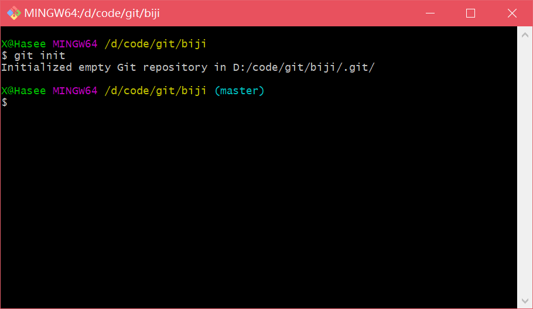
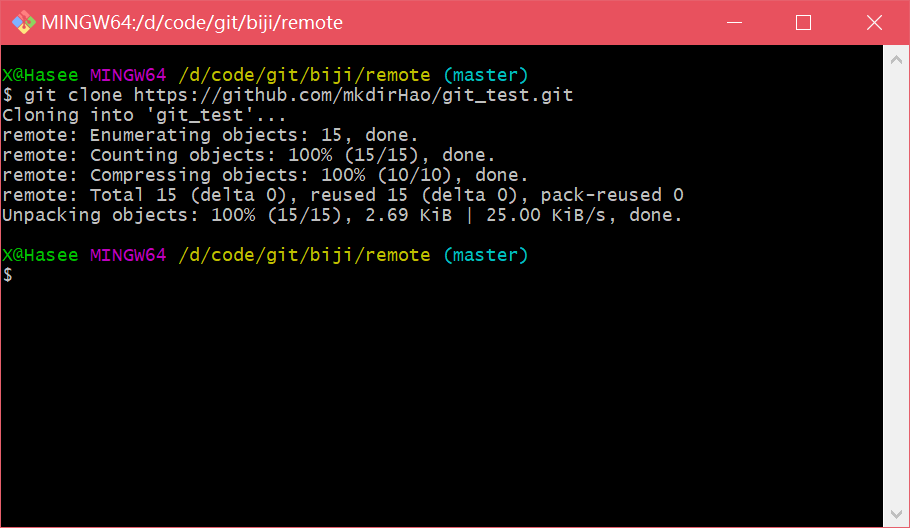
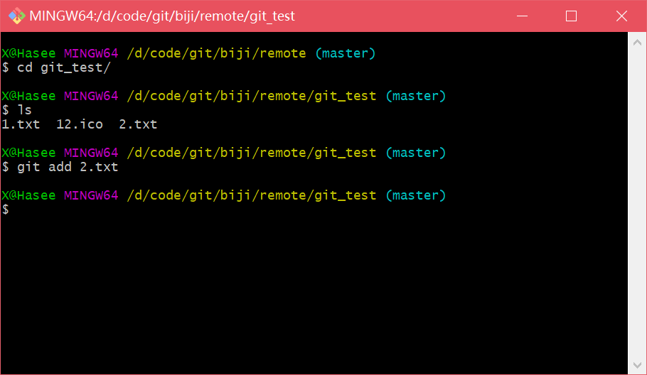
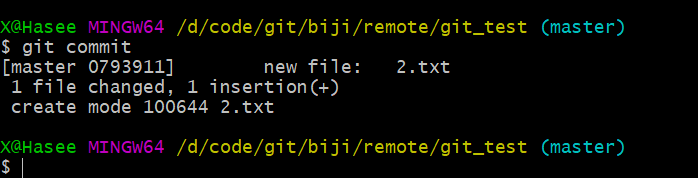
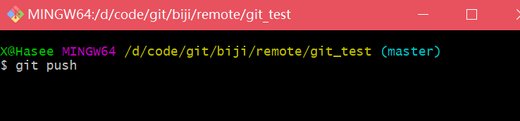
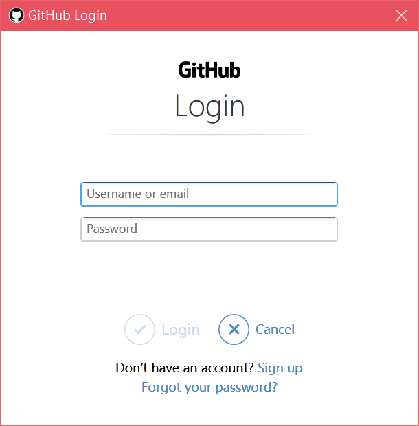
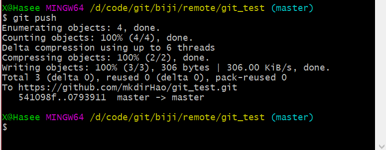
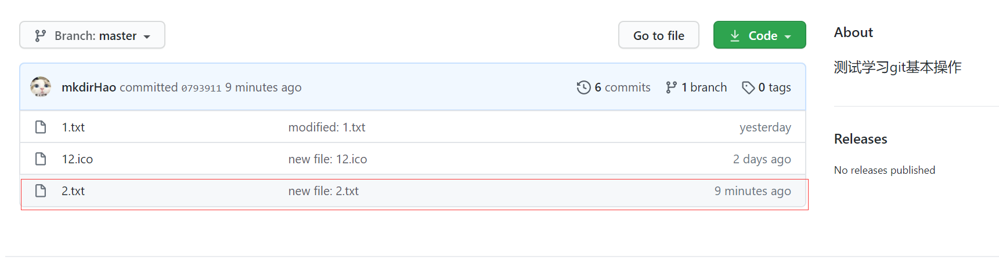

# Git基本操作

## Git配置

查看配置 git config -l




查看不同级别的配置文件

```
#查看系统config
git config --system --list

#查看当前用户（global）配置
git config --global --list

```


**Git相关的配置文件：**

1）、Git\etc\gitconfig  ：Git 安装目录下的 gitconfig   --system 系统级

2）、C:\Users\Administrator\ .gitconfig   只适用于当前登录用户的配置  --global 全局


> 设置用户名与邮箱（用户标识，必要）


安装git后最重要的就是设置用户名和Email地址

每次提交都会用到这些信息

```
git config --global user.name "YanJieMao" 
git config --global user.email "YanJieMao@qq.com"
```


*如果你希望在一个特定的项目中使用不同的名称或e-mail地址，你可以在该项目中运行该命令而不要--global选项。总之--global为全局配置，不加为某个项目的特定配置。*


## Git命令

### 新建仓库

> 在本地新建 git init 



> 从远程仓库clone git clone https://github.com/mkdirHao/git_test.git




### 添加到缓冲区

> git add




### 提交到本地仓库

> git commit




### 提交到远程仓库

> git push




输入命令后会让输入账户密码



 账号密码正确后就可以成功提交到远程仓库了



看一下我们的远程仓库，这时已经有了




