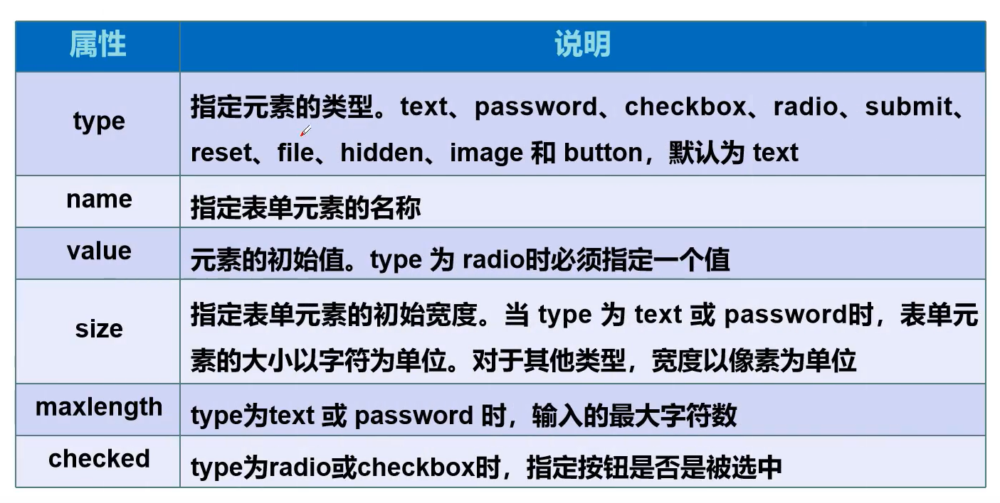

# HTML5

## 1.网页基本信息

html基本结构

DOCTTYPE声明

标签

>  第一个网页

```html

<!DOCTYPE html>
<!--DOCTYPE 告诉浏览器,我们使用什么规范-->
<html lang="en">

<!--head 代表网页的头部  -->
<head>
	<!-- meta描述性标签,用来描述网站的一些信息 -->
	<!-- 一般用来做seo -->
	<meta charset="utf-8">
	<meta name="keywords" content="眼睫毛的网站">
	<meta name="description" content="来这里可以学习计算机">
	
	<!-- 网页的标题 -->
	<title>第一个网页</title>
</head>

<!-- body表示网页的主体 -->
<body>
若无闲事挂心头,便是人间好时节. 
</body>
</html>
```

## 2.基本标签学习

- 标题标签
- 段落标签
- 换行标签
- 水平线标签
- 字体样式标签
- 注释和特殊符号

```html

<!DOCTYPE html>
<html lang="en">
<head>
</head>
<body>

<!-- 标题标签 -->
<h1>一级标签</h1>
<h2>二级标签</h2>
<h3>三级标签</h3>
<h4>四级标签</h4>
<h5>五级标签</h5>
<h6>六级标签</h6>

<!-- 段落标签 -->
<p>客路青山外，行舟绿水前。</p>
<p>潮平两岸阔，风正一帆悬。</p>

<!-- 水平线标签 -->
<hr/>

<!-- 换行标签 -->
客路青山外，行舟绿水前。
<br/>
潮平两岸阔，风正一帆悬。

<!-- 粗体,斜体标签 -->
<h1>字体样式标签</h1>
粗体:<strong>啦啦啦啦啦</strong>
斜体:<em>啦啦啦啦啦</em>
<br/>
<!-- 特殊符号 -->
&nbsp;空格
<br/>
&gt;大于
<br/>
&lt;小于
<br/>
&copy;版权符号

</body>
</html>
```


## 3.图像标签

```html

<!DOCTYPE html>
<html lang="en">

<head>
	<meta charset="utf-8">
	<title>图像标签</title>
</head>
<body>
<!-- img 
  相对地址 绝对地址
  ../ 上一级目录
  alt:图片名字(必填)
-->

</body>
</html>
```


## 4.超链接标签及应用


页面间链接

```html


<!DOCTYPE html>
<html lang="en">

<head>
	<meta charset="utf-8">
	<title>连接标签</title>
</head>

<body>
<!--a标签
 href: 一定得有,表示跳转到哪里
 target: 表示新标签在哪里打开
		_blank 在新窗口打开
		_self 在原来的窗口打开,默认self

-->

<a href="http://www.baidu.com" target="_blank">点击跳转百度</a>
<br>
<a href="http://www.baidu.com">点击跳转百度</a>
<br>
<a href="http://www.baidu.com">

</a>
</body>
</html>


```

锚链接

```html
<!-- 锚链接
1.需要一个锚标记
2.跳转到标记
 --> 

<a href="#top">回到顶部</>
<a href="http://news.baidu.com#footer">点击跳转百度</a>
```


功能性链接

```html
<!-- 功能性链接
  邮件链接:mailto:
  qq链接

-->
<a href="mailto:1447748014@qq.com">邮箱联系我</>
<a target="_blank" href="http://wpa.qq.com/msgrd?v=3&uin=&site=qq&menu=yes">
</a>

```

## 5.行内元素和块元素

块元素:

- 无论内容多少,该元素独占一行
- (p,h1-h6....)

行内元素

- 内容撑开宽度,左右都是行内元素的可以排在一行
- <a .strong . em ....)

## 6.列表标签

``` html

<!DOCTYPE html>
<html lang="en">

<head>
	<meta charset="utf-8">
	<title>列表标签</title>
</head>

<body>

<!--有序列表-->

<ol>
	<li>java</li>
	<li>c</li>
	<li>前端</li>
</ol>

<!--无序列表-->

<ul>
	<li>java</li>
	<li>c</li>
	<li>前端</li>
	
</ul>

<!--自定义列表-->
<dl>
	<dt>科目</dt>
	<dd>语文</dd>
	<dd>数学</dd>
	<dd>英语</dd>
	<dd>理综</dd>

</dl>
	
	

</body>
</html>
```

## 7.媒体元素


```html

<!DOCTYPE html>
<html lang="en">

<head>
	<meta charset="utf-8">
	<title>媒体元素</title>
</head>

<body>

<!-- 音频和视频
src:资源目录
controls:进度条
autoplay :自动播放
-->
<video src="./img/1.mp4" controls autoplay> </video>
<br>
<audio src="./img/2.mp3" controls autoplay> </audio>

</body>
</html>
```

## 8.iframe内嵌框架

```html

<!DOCTYPE html>
<html lang="en">

<head>
	<meta charset="utf-8">
	<title>iframe </title>
</head>

<body>
<!-- iframe 内联框架
src:地址
-->
<iframe name="hello" src="http://www.baidu.com" frameborder="0" width=800" height="800"></iframe>
<a href="http://news.baidu.com" target="hello">点击跳转</a>


</body>
</html>
```

## 9.表单post和get提交

```html 

<!DOCTYPE html>
<html lang="en">

<head>
	<meta charset="utf-8">
	<title>post-get</title>
</head>

<body>
<!--表单form
action : 表单提交的位置,可以是网站也可以是一个请求处理地址,向何处提交表单数据
method :post get 提交方式
      get方式提交:可以在url中看到提交的信息,不安全,搞笑
	  post:看不到安全,可以传输大文件
-->

<form action="1.html" method="get">
	<p>名字:<input type="text" name="username"> </p>
	<p>密码:<input type="password" name="password"> </p>
	<p> 
		<input type="submit">
		<input type="reset">
	</p>
</body>
</html>
```

## 10.表单元素



```html


<!DOCTYPE html>
<html lang="en">

<head>
	<meta charset="utf-8">
	<title>post-get</title>
</head>

<body>
<!--表单form
action : 表单提交的位置,可以是网站也可以是一个请求处理地址,向何处提交表单数据
method :post get 提交方式
      get方式提交:可以在url中看到提交的信息,不安全,搞笑
	  post:看不到安全,可以传输大文件
-->

<form action="1.html" method="get">
	<p>名字:<input type="text" name="username"> </p>
	<p>密码:<input type="password" name="password"> </p>
	
	
<!-- 单选框标签
 input type="radio"
 value:单选框的值
 name:表示组
 -->
<p>性别:
	<input type="radio" value="boy" name="sex"/>男
	<input type="radio" value="girl" name="sex"/>女
</p>
 
<!-- 多选框
 input type="checkbox"
  -->
<p>爱好:
	<input type="checkbox" value="sleep" name="hobby">睡觉
	<input type="checkbox" value="code" name="hobby">写代码
	<input type="checkbox" value="chat" name="hobby">聊天
	<input type="checkbox" value="tv" name="hobby">看电视
</p>
<!-- 按钮 
input type="button" 普通按钮 
input type="image"  图像按钮,也可以提交
input type="submit"  提交按钮
input type="reset"   重置按钮
-->

<p>按钮:
	<input type="button" name="btn1" value="点我">
	图片按钮:
	<input type="image" src="./img/1.jpg" width="25px" heigh="25px">
</p>


<!-- 下拉框,列表框 

-->
<p>国家:
	<select name="列表名称">
		<option value="china">中国</option>
		<option value="usa">美国</option>
		<option value="japan">日本</option>
		<option value="korea">韩国</option>
	</select>
</P>

<!-- 文本域
 cols="50" rows="10"
 -->
 
<p>反馈:
	<textarea name="textarea" cols="50" rows="10">啦啦啦</textarea>
</p>

<!-- 文件域
input type="file"
 -->
<p>
	<input type="file" name="files">
	<input type="button" value="上传" name="upload">
</p>


<!-- 邮件验证 -->

<p> 邮箱:
	<input type="email" name="email">
</P>

<!-- url -->

<p> URl :
	<input type="url" name="url">
</P>

<!-- 数字 -->
 
<p> 数字:
	<input type="number" name="num" max="100" min="10" step="10">
</P>

<!-- 滑块 -->

<p>音量:
	<input type="range" name="voice" min="0" max="100" step="5">
</p>

<!-- 搜索框 -->
<p>搜索:
	<input type="search" name="search">
</p>

<p> 
	<input type="submit">
	<input type="reset">
</p>
</body>
</html>
```

## 11.表单简单应用

隐藏域 hidden

只读   readonly

禁用  disabled

**表单初级验证**

- placeholder  提示信息
- require      非空判断
- pattern    正则表达式