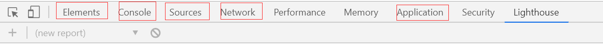
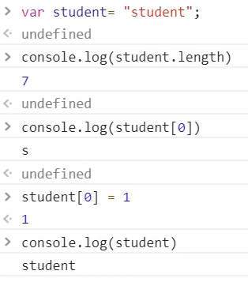
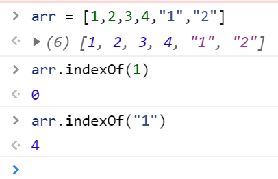
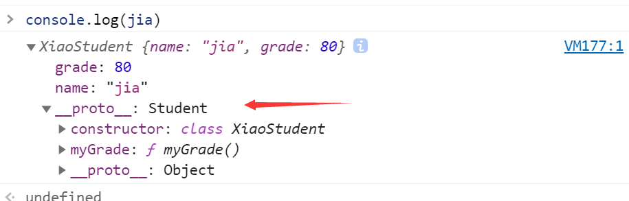
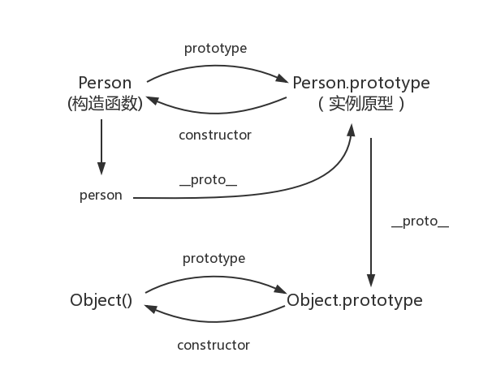
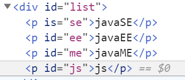
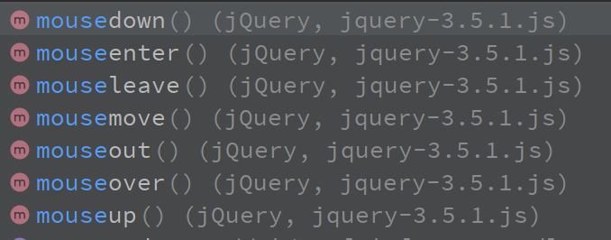

# 1.什么是JavaScript

## 1.1、概述

JavaScript是世界上最流行的一门脚本语言

` 一个合格的后端人员，必须要精通JavaScript`

## 1.2、历史

历史

[https://blog.csdn.net/kese7952/article/details/79357868](https://blog.csdn.net/kese7952/article/details/79357868)

**ECMAScript**可以理解为是JavaScript的一个标准

最新版本es6

但大部分浏览器还是支持es5


# 2.快速入门


## 2.1、引入JavaScript

1.内部标签

```html
<script>
  //....
</script>
```


2.外部引入

abs.js

```javascript
//....

```

test.html

```html
<script src="abc.js"></script>
```

第一个JavaScript弹窗

```html
<!DOCTYPE html>
<html lang="en">
<head>
    <meta charset="UTF-8">
    <title>Title</title>
<!--script标签内，写js代码-->
<!--    <script>-->
<!--        alert('你好，世界')-->
<!--    </script>-->
<!--外部引入-->
<!--注意：script标签成对出现-->
    <script src="js/first.js"></script>

<!--不用显示定义-->
    <script type="text/javascript"></script>
</head>
<body>


<!--这里也可以存放js代码-->
</body>
</html>
```

## 2.2、基本语法入门

```html
<!--    JavaScript严格区分大小写-->
    <script>
        // 1.定义变量
        var score= 75;
        //alert(num);
        // 2.条件控制
        if(score>60 && score<70){
            alert("60-70");
        }else if(score>70 && score<80){
            alert("70-80");
        }else{
            alert("other");
        }

        //console.log(score)在浏览器的控制台打印变量


    </script>
```


浏览器调试



## 2.3、数据类型

数值，文本，图形，音频，视频、、、

==变量==

```js
var a = 1
```


==number==

js不区分小数和整数

```js
123 //整数123
123.1 //浮点数123.1
1.23e4 //科学计数法
-99 //负数
NaN //not a number
Infinity //表示无限大
```

==字符串==

'abc',"abc"


==布尔值==

true false


==逻辑运算==

```
&& 两个都为真，结果为真

|| 一个为真，结果为真

！ 真即假，假即真
```


==比较运算符==

```
=

== 等于（类型不一样，值一样，也会判断为true）

=== 绝对等于（类型一样，值一样，结果为true）
```

这是js的缺陷，不要用==比较

> 注意：
>
> NaN===NaN,这个与所有的数值都不相等，包括自己
>
> 只能通过isNan(NaN)来判断是否是NaN


浮点数问题

```js
 console.log((1/3) === (1-2/3));
```

尽量避免使用浮点数进行运算，存在精度问题

```html
console.log(Math.abs(1/3-(1-2/3))<0.00000001)
```


==null和underfine==

- null 空
- undefined未定义

==数组==

Java的数值必须是一系列相同类型的对象,js不需要

```js
//保证代码可读性，尽量使用[]
var arr = [1,2,3,4,5,'helo',null,true];
new Array(1,2,4,5,'kkk');
```

取数组下标，如果越界了，就会undefined


==对象==

对象是大括号，数组是中括号

每个属性之间用逗号隔开，最后一个不需要

```js
//Person person = new Person(1,2,3,4,5)
var person = {
  name: "haodapang",
  age: 3,
  tags: ['js','java','web','...']
}
```

取对象的值

```js
person.age
>3
person.tags
>(4) ["js", "java", "web", "..."]
```


## 2.4、严格检查模式

```html

<!DOCTYPE html>
<html lang="en">
  <head>
    <meta charset="UTF-8">
    <title>Title</title>

<!--
'use strict'严格检查模式，预防JavaScript的随意性导致产生以下问题
局部变量都建议使用let定义
'use strict' 必须写在JavaScript的第一行
-->
    <script>
      'use strict'
      //全局变量
      let i = 1;
      // es6 中 let
    </script>
  </head>
  <body>

  </body>
</html>
```


# 3.数据类型

## 3.1、字符串

1. 正常字符串使用 **单引号** 或者 **双引号** 包裹

2. 注意转义字符

   ```
   \'
   \n
   \t
   \u42ed \u#### Unicode字符
   \x41 Ascll字符
   ```

3. 多行字符编写

   ```js
   //反引号`
   var msg =
       `hello
   world
   你好`
   ```

4. 模板字符串

   ```JS
   
   let name = "haodapang";
   let age = "18";
   let msg = `你好呀，${name}`
   ```
   
5. 字符串长度

   ```
   str.length
   ```

6. 字符串的可变性，不可变

   

7. 大小写转换

   ```
   //注意这里是方法不是属性
   student.toUpperCase()
   student.toLowerCase()
   ```

8. student.indexOf('t')

9. substring

   ```
   [)
   student.substring(1)//从数组第一个字符串截取到最后一个字符
   student.substring(1,3) //[1,3)
   ```


## 3.2、数组


Array可以包含任意的数据类型

```js
var arr = [1,2,3,4,5,6]
```

1、 长度

```
arr.length
```

注意: 假如给arr.length赋值，数组大小就会放生变化，如果赋值过小，元素就会丢失。

2、indexOf,通过元素获得下表索引

```
arr.indexOf(2)
1
```

字符串的 "1" 和数字 1 不一样



3、slice（） 截取Array 的一部分，返回一个新数组，类似于string中的substring

4、push() pop ()

```
push 压入到尾部
pop 弹出尾部一个元素
```

5、unshift() shift() 头部

```
unshift 压入到头部
shift 弹出头部的一个元素
```

6、 排序 sort()

```js
arr
(7) [8, 1, 2, 3, 4, "1", "2"]
arr.sort()
(7) [1, "1", 2, "2", 3, 4, 8]
```

7、 元素反转reverse()

```js
arr
(7) [1, "1", 2, "2", 3, 4, 8]
arr.reverse()
(7) [8, 4, 3, "2", 2, "1", 1]
```

8、concat()

```js
arr
(7) [1, "1", 2, "2", 3, 4, 8]
arr.concat([6,6,6])
(10) [8, 4, 3, "2", 2, "1", 1, 6, 6, 6]
```

注意：这个方法并没有修改数组，只是会返回一个新的数组。

9、连接符join

打印拼接数组，使用特定的字符串连接

```js
arr
(7) [8, 4, 3, "2", 2, "1", 1]
arr.join('-')
"8-4-3-2-2-1-1"
```

10、多维数组

```js
arr = [[1,2],[3,4],[5,6]]
arr[1][1]
4
```


数组： 数据存储（如何存，如何取，方法都可以自己实现）


## 3.3、对象

若干个键值对

```js
var 对象名 = {
  属性名： 属性值，
  属性名： 属性值，
  属性名： 属性值         
 }

var person = {
  name: "hao",
  age: 18,
  sex: "boy"

}
```


js中的对象，｛.....｝表示一个对象，键值对描述属性，xxx:xxx ,多个属性使用逗号隔开，**最后一个属性不加逗号！**

js中的所有键都是字符串，值是任意对象！

1、对象赋值

```js
person.name
"hao"
person.name = "haodapang"
"haodapang"
```

2、使用一个不存在的对象属性，不会报错！ undefined

```js
person.haha
undefined
```

3、动态删减属性,通过delete删除属性

```js
delete person.name
true
```

4、动态添加属性，直接给新的属性添加值即可

```js
person.hah = "haha"
"haha"
```

5、判断属性值是否在这个对象中@！xxx in xxx!

```js
'age' in person
true
//继承
'toString' in person
true
```

6、判断一个属性是否是这个对象自身拥有的hasOwnProperty()

```js
person.hasOwnProperty('toString')
false
person.hasOwnProperty('age')
true
```

## 3.4、流程控制

if判断

```js
var age = 3;
if(age > 3){
  alert("hahaha");

} else{
  alert("wawa");
}

```


while循环,避免程序死循环

```js
while(age < 100){
  age = age + 1;
  console.log(age);
}

do{
  age = age + 1;
  console.log(age);
}while(age < 100)
```


for循环

```js
 for (let i = 0; i < 100; i++){
            console.log(i);
 }
```

forEach循环 5.1引入

```js
var age = [1,2,34,45,65,76,33,44];

age.forEach(function(value){
  console.log(value)
})

```

for..in

```js
var age = [1,2,34,45,65,76,33,44];

for(var num in age){

  console.log(age[num]);
}

```


for ...of

```js
var age = [1,2,34,45,65,76,33,44];

for(var num of age){

  console.log(num);
}
```


## 3.5、Map和Set

Map

```js
//学生的成绩，学生的名字
// var names = ["tom","jack","lucy"];
// var scores = [100,90,80]
var map = new Map([['tom',100],['jack',90],['lisa',85]]);
var name = map.get('tom');//通过key获取value
map.set('liu',99);//新增修改
map.delete("tom");//删除
```

Set:无序不重复的集合

```js
var set = new Set([2,3,3,3]);//set可以去重
set.add(1);//添加
set.delete(3);//删除
console.log(set.has(1));//是否包含某个元素
```

## 3.6、iterator

> es6新特性

使用iterator来便利迭代Map,Set!

```js
//通过for of 实现 / for in 下标
var arr = [3,4,5];
for (var x of arr){
  console.log(x);
}
```


遍历map

```js
var map = new Map([['tom',100],['lisa',89],['wang',88]]);
for(let x of map){
  console.log(x);
}
```


遍历set

```js
var set = new Set([5,6,7]);
for(let x of set){
  console.log(x);
}
```


# 4.函数

## 4.1、定义函数

> 定义方式一

```js
function abs(x){
  if(x >= 0){
    return x;
  }else {
    return -x;
  }
}
```

一旦执行到return代表函数结束，返回结果。

如果没有执行return，函数执行也会返回结果，结果就是underfined


> 定义方式二


```js
var abs = function(x){
  if(x >= 0){
    return x;
  }else {
    return -x;
  }
  
}
```

function(x).... 这是一个匿名函数，但是可以把结果复制给abs，通过abs就可以调用函数！


> 调用函数

```js
abs(10)
abs(-10)
```

参数问题，js可以传任意个参数，也可以不传

参数进来是否存在问题？

假设不存在参数，如何规避？

```js
function abs(x){
  //手动抛出异常
  if (typeof x!== 'number'){
    throw 'Not a Number';
  }
  if(x >= 0){
    return x;
  }else {
    return -x;
  }
}
```


> arguments

`arguments`是一个js免费赠送的关键字

代表，传递进来的所有参数，是一个数组!

```js
function abs(x){
  console.log("x=>"+x);
  for (var i = 0; i < arguments.length;i++){
    console.log(arguments[i]);
  }
  if(x >= 0){
    return x;
  }else {
    return -x;
  }
}
```


问题；arguments会包含所有的参数，我们有时候想使用多余的参数进行其他操作，需要排除已有的参数。


> rest

以前

```js
if(arguments.length>2){
  for (var i = 2; i < arguments.length; i++){
	//....
  }
}
```

es6引入的新特性，获取除了已经定义的参数之外的所有参数

```js
function aaa(a,b,...rest){
  console.log("a=>"+a);
  console.log("b=>"+b);
  console.log(rest);
}
```

rest参数只能写在最后面，必须用...标识


## 4.2、变量作用域

在js中，vat变量实际是有作用域的

假设在函数体中声明，则在函数体外不可以使用（闭包）

```js
function hao(){
  var x = 1;
  x = x + 1;
}
x = x +1 ; //Uncaught ReferenceError: x is not defined
```

内部函数可以访问外部函数的变量，反过来不可以

```js
function hao(){
  var x = 1;
  x = x + 1;
  //内部函数可以访问外部函数的变量，反过来不可以
  function hao2(){
    var y = x + 1; //2

  }
  var z = y + 1;// Uncaught ReferenceError: y is not defined
}
```

假设内部函数变量和外部函数的变量同名，


```js
function hao(){
  var x = 1;
  x = x + 1;
  //内部函数可以访问外部函数的变量，反过来不可以
  function hao2(){
    var x = 'a';
    console.log('inner'+x);

  }
  console.log('outer'+x);
  hao2();

}
hao();
```

假设在js中函数查找变量从自身函数开始，由 “内”向“外”查找。假设外部存在这个同名的，内部函数会屏蔽外部变量

> 提升变量的作用域

```js
function hao(){
  var x = "x" + y;
  console.log(x);
  var y = 'y';
}
```


结果： undefined

说明： js执行引擎，自动提升了y的声明，但是不会提升变量y的赋值。


```js
function hao2{
  var y;
  var x = 'x'+y;
  console.log(x);
  y = 'y';
}
```

这个是在js建立之初就存在的特性，规范，变量放在头部，不要乱放，便于维护。

```js
function hao(){
  var x = 1;
  y = x + 1;
  z,i,z //undefined
}
```


> 全局变量


```js
//全局变量
x = 1;

function f() {
  console.log(x);
}
f();
console.log(x);

```


全局对象 window

```js
var x = 'xxx';
alert(x);
alert(window.x);//默认所有的全局变量都会绑定在window对象下；
```

alert()这个函数本身也是一个`window`变量

```js
var x = 'xxx';
alert(x);
alert(window.x);//默认所有的全局变量都会绑定在window对象下；

var old_alert = window.alert;
old_alert(x);

window.alert = function(){

};
//发现alert失效
window.alert(123);
//恢复
window.alert = old_alert;
window.alert(123);
```

js实际上只有一个全局作用域，任何变量（函数也可以看做变量），假设没有在函数作用范围内找到，就会向外找，如果在全局作用域都没找到， 报错`RefrenceError`

> 规范


由于所有的全局变量都会绑定到window上，如果不同的js文件，使用了相同的全局变量，冲突，，，如何能够减少冲突?

```js
//唯一全局变量
var haoApp = {};

//定义全局变量
haoApp.name = 'haodapang';
haoApp.add = function(a,b){
  return a + b;
}
```

把自己的代码全部放到自己定义的唯一空间名字中，降低全局命名冲突的问题


> 局部作用于let


```js
function hao(){
  for (var i = 0; i < 100; i++){
    console.log(i)
  }
  console.log(i+1);//问题？i除了作用域还能用
}
```

ES6 let关键字，解决局部作用域冲突问题

```js
function hao(){
  for (let i = 0; i < 100; i++){
    console.log(i)
  }
  console.log(i+1);//ReferenceError: i is not defined
}
```

建议局部变量使用`let`


> 常量const

在ES6之前，怎么定义常量，全部用大写字母命名的变量就是常量,建议不要修改这样的值

```js
var PI = '3.14';

console.log(PI);
PI = '213';//可以改变这个值
console.log(PI);

```

在ES6中引入了常量关键字`const`

```js
const PI = '3.14';//只读变量
console.log(PI);
PI = '213';//Assignment to constant variable.
console.log(PI);
```

## 4.3、方法


> 定义方法

方法就是把函数放在对象的里边，对象只有两个东西，方法和属性。

```js
var hao = {
  name:'haodapang',
  birth:'2010',
  age: function(){
    var now = new Date().getFullYear();
    return now -this.birth;
  };
};
hao.name //属性
hao.age()//方法一定要带括号
```

this,代表什么？拆开上面的代码看看

```js
function getAge(){
  var now = new Date().getFullYear();
  return now -this.birth;
};
var hao = {
  name:'haodapang',
  birth:'2010',
  age: getAge
};
hao.age()//可以
getAge()//NaN window对象没有 
```

this是无法指向的，是默认指向调用的那个对象

> apply

在js中可以控制this的指向

```js
function getAge(){
  var now = new Date().getFullYear();
  return now -this.birth;
};
var hao = {
  name:'haodapang',
  birth:'2010',
  age: getAge
};
// hao.age()//可以
// getAge()//NaN

getAge.apply(hao,[]);//this指向了hao
```

# 5.对象

> 标准对象

```js
typeof '2'
"string"
typeof 123
"number"
typeof NaN
"number"
typeof []
"object"
typeof true
"boolean"
typeof Math.abs
"function"
typeof undefined
"undefined"
```


## 5.1、Date

**基本使用**

```js
var now = new Date();
now.getFullYear();//年
now.getMonth();//月
now.getDate();//日
now.getDay();//星期几
now.getHours();//时
now.getMinutes();//分
now.getSeconds();//秒
now.getTime();//时间戳 全世界统一  1970 1.1 0：00:00 到今天的毫秒数
console.log(new Date(1578106175991));
```

转换

```js
now = new Date()
Fri Sep 11 2020 22:59:06 GMT+0800 (中国标准时间)
now.toLocaleDateString();
"2020/9/11"
now.toLocaleString();//注意调用是一个方法，不是一个属性
"2020/9/11 下午10:59:06"
now.toGMTString();
"Fri, 11 Sep 2020 14:59:06 GMT"
now.toISOString();
"2020-09-11T14:59:06.042Z"
```


## 5.2、JSON 


> json是什么

- [JSON](https://baike.baidu.com/item/JSON)([JavaScript](https://baike.baidu.com/item/JavaScript) Object Notation, JS 对象简谱) 是一种轻量级的数据交换格式。
- 简洁和清晰的层次结构使得 JSON 成为理想的数据交换语言。
- 易于人阅读和编写，同时也易于机器解析和生成，并有效地提升网络传输效率。

在js中一切皆为对象，任何js支持的类型都可以用json来表示

格式：

- 对象都用{}
- 数组都用[]
- 所有的键值对 都是用key:value


JSON和js对象的转化

```js
var user = {
  name: "haodapang",
  age: 3,
  sex: '男'
}

//对象转化为json
var jsonUser = JSON.stringify(user);

//字符串转化为对象 参数为json字符串
var obj = JSON.parse('{"name":"haodapang","age":3,"sex":"男"}');
```


JSON和js对象的区别

```js
var obj = {a:'helloa',b:'hellob'};
var json = '{"a":"helloa","b":"hellob"}';
```

## 5.3、Ajax

- 原生的js写法 xhr异步请求
- jquey封装好的方法  ${"#name"}.ajax("")
- axios 请求


# 6.面向对象编程

## 6.1、什么是面向对象


js java c# .....面向对象 js中有些区别

- 类 模板
- 对象 具体的实例

原型

```js
var user = {
  name: "haodapang",
  age: 3,
  run: function (){
    console.log(this.name + "run...");
  }
};

var lisa = {
  name: "lisa"
};
//lisa的原型是 user
lisa.__proto__ = user;
```

```js
function Student(name){
  this.name = name;
};

//给student新增一个方法
Student.prototype.hello = function() {
  alert('hello');

};
```


> class继承

`class`关键字，是在ES6引入的

1、定义一个类，属性，方法

```js
//ES6之后==========
//定义一个学生类
class student{
  constructor(name) {
    this.name = name;

  }
  hello(){
    alert('hello');
  }
}
var hao = new student("hao");
hao.hello();
```

2、继承


```js
class Student{
  constructor(name) {
    this.name = name;

  }
  hello(){
    alert('hello');
  }
}

class XiaoStudent extends Student{
  constructor(name,grade) {
    super(name);
    this.grade = grade;
  }
  myGrade(){
    alert('我成绩很好');
  }
}

var hao = new Student("hao");
var jia = new XiaoStudent('jia',80);
```

本质： 查看对象原型



> 原型链

__ proto __:




# 7.操作BOM对象模型 (重点)

> 浏览器介绍

js和浏览器关系

js的诞生就是为了能够在浏览器中运行

BOM：浏览器对象模型

- ie
- Chrome
- Safari
- Firefox （linux默认浏览器）
- Opera（份额太小）

> window

window代表浏览器窗口

```js
window.innerHeight
817
window.innerWidth
205
window.outerHeight
936
window.outerWidth
868
window.alert(1)
```

> Navigator

Navigator，封装了浏览器的信息

```js
navigator.appName
"Netscape"
navigator.appVersion
"5.0 (Windows NT 10.0; Win64; x64) AppleWebKit/537.36 (KHTML, like Gecko) Chrome/85.0.4183.102 Safari/537.36 Edg/85.0.564.51"
navigator.platform
"Win32"
navigator.userAgent
"Mozilla/5.0 (Windows NT 10.0; Win64; x64) AppleWebKit/537.36 (KHTML, like Gecko) Chrome/85.0.4183.102 Safari/537.36 Edg/85.0.564.51"
```

大多数我们不会使用`navigator`对象，因为会被人为修改！

不建议使用这些属性来判断和编写代码

> screen

代表屏幕尺寸(缩放后的)

```js
screen.width
1707
screen.height
960
```

> location(重要)

location代表当前页面的url信息

```js
host: "www.baidu.com"
hostname: "www.baidu.com"
href: "https://www.baidu.com/?tn=simple"
protocol: "https:" //协议
reload: ƒ reload() //刷新网页
//设置新的地址
location.assign('http://www.haojiayi.top');

```


> document

document 代表当前的页面，html DOM文档树

获取具体的文档树节点

```js
<dl id="app">
    <dt>java</dt>
    <dt>javaEE</dt>
    <dt>javaSE</dt>
</dl>

<script>
    var dl = document.getElementById('app');
</script>
```

获取cookie

```js
document.cookie
"PSTM=1597499734; BAIDUID=9E93535966774AC39656F2C499D47525:FG=1; BD_UPN=12314753; BIDUPSID=E7E4AD5C592289F9ECC47EAE8A039E5E; BDORZ=B490B5EBF6F3CD402E515D22BCDA1598; COOKIE_SESSION=5_0_2_2_1_1_1_0_2_1_1_0_0_0_5_0_1597499240_0_1597499235%7C2%230_0_1597499235%7C1; delPer=0; BD_CK_SAM=1; PSINO=2; BDRCVFR[BDRWZOpqott]=jI8nAleq-GtpA7Eph-9Xyb8IAqs; BD_HOME=1; H_PS_PSSID=7513_32606_1444_32693_32328_7624_32691; sugstore=0"
```

劫持cookie代码

www.taobao.com

```js
<script src='aaa.js'></script>
//恶意人员获取cookie上传到他的服务器
```

服务器端可以设置cookie :httpOnly

> history（不建议使用）

代表浏览器的历史记录

```js
history.back()//后退
history.forword()//前进
```

# 8.操作DOM对象（重点）

DOM：文档对象模型

> 核心

浏览器网页就是一个DOM树形结构

- 更新 更新Dom节点
- 遍历dom节点：得到dom节点
- 删除： 删除一个DOM节点
- 添加： 添加一个Dom节点

要操作一个DOM节点，就必须先获得这个DOM节点


获得DOM节点

```js
//对应css选择器
var h1 = document.getElementsByTagName('h1');
var p1 = document.getElementById('p1');
var p2 = document.getElementsByClassName('p2');
var father = document.getElementById('father');
var children = father.children;//获取父节点下所有的子节点
// father.firstChild;
// father.lastChild;
```

这是原生代码，之后我们都是用jQuery


> 更新节点

```html
<div id="id1">
</div>
<script>
  var id1 = document.getElementById('id1'):
</script>
```

操作文本

- `id1.innerText = '123'`修改文本的值

- `id1.innerHTML = '<strong>123</strong>'`

  

```js
id1.innerText = '123'
"123"
```

操作CSS

```js
id1.style.color = 'red' //属性使用字符串
"red"
id1.style.fontSize= '20px'
"20px"
```


> 删除节点


删除结点的步骤：先删除父节点，再通过父节点删除子节点

 ```html
<div id = "father">
  <h1>标题一</h1>
<p id="p1">p1</p>
<p class="p2">p2</p>
</div>
<script>
  var self = document.getElementById('p1');
  var father = p1.parentElement;
  father.removeChild(p1);
  //删除是一个动态的过程，下边这种方式不可以
  father.removeChild(father.children[0])
  father.removeChild(father.children[1])
  father.removeChild(father.children[2])
</script>
 ```


注意：删除多个节点的时候，children是在时刻发生变化的，删除节点的时候，一定要注意。


> 插入节点

我们获得了某个dom节点，加入这个dom节点是空的，我们通过innerhtml就可以增加一个元素，但是dom节点已经存在元素了，我们就不能这么办了。

追加

```html
<p id="js">js</p>
<div id = "list">
  <p is="se">javaSE</p>
  <p id="ee">javaEE</p>
  <p id="me">javaME</p>
</div>

<script>
  var js = document.getElementById('js');
  var list = document.getElementById('list');
  list.append(js);//追加到后面
</script>
```

追加效果




> 创建一个新的标签实现插入

```html
<script>
  var js = document.getElementById('js');
  var list = document.getElementById('list');
  //通过js创建一个新节点
  var newP = document.createElement('p');//创建一个p标签
  newP.id = 'newP';
  newP.innerText = 'hello';
  list.appendChild(newP);
  //创建一个标签节点(通过这个属性，可以设置任意的值)
  var myScript = document.createElement('script');
  myScript.setAttribute('type','text/javascript');
  
  var myStyle = document.createElement('style');//创建了一个空style标签
  myStyle.setAttribute('type','text/javascript');
  myStyle.innerHTML = 'body{background-color:red;}';//设置标签内容

  document.getElementsByTagName('head')[0].appendChild(myStyle);
</script>
```


> insert

```js
var ee = document.getElementById('ee');
var js = document.getElementById('js');
var list = document.getElementById('list');
//要包含的节点，insetBefore(newnode,targetnode)
list.insertBefore(js,ee);
```


# 9.操作表单(验证)

> 表单是什么 form DOM树


- 文本框 text
- 下拉框  <select>
- 单选框 radio
- 多选框 checkbox
- 隐藏域 hidden
- 密码框 password

表单目的，提交信息


> 获得要提交的信息

```html
<body>

  <form method="post">
    <p>
      <span>用户名：</span><input type="text" id="userName">
    </p>

    <p>
      <span>性别：</span>
      <input type= "radio" name="sex" value="man" id="boy">男
      <input type= "radio" name="sex" value="women" id="girl">女
    </p>

  </form>

  <script>
    var input_text = document.getElementById('userName');
    var boy_radio = document.getElementById('boy');
    var gril_radio = document.getElementById('girl');
    //得到输入框的值

    //修改输入框的值
    input_text.value = '456';
    //对于单选框，多选框等等固定的值，boy_radio.value只能取到当前的值
    boy_radio.checked//查看结果是否是true，true选中，false未选中

  </script>

</body>

```


> 提交表单

```html
<!DOCTYPE html>
<html lang="en">
<head>
    <meta charset="UTF-8">
    <title>Title</title>
</head>
<body>

<form method="post">
    <p>
        <span>用户名：</span><input type="text" id="userName">
    </p>

    <p>
        <span>密码：</span><input type="password" id="passwords">
    </p>

    <p>
        <span>性别：</span>
        <input type= "radio" name="sex" value="man" id="boy">男
        <input type= "radio" name="sex" value="women" id="girl">女
    </p>

    <!--    绑定事件，onclick,被点击-->
    <button type="button" onclick="post()">提交</button>

</form>

<script>
    function post(){
       var userName = document.getElementById('userName');
       var passwords = document.getElementById('passwords');
       console.log(userName.value);
       console.log(passwords.value);
    }


</script>

</body>
</html>
```


> 前端md5加密

```html
<!DOCTYPE html>
<html lang="en">
<head>
    <meta charset="UTF-8">
    <title>Title</title>
<!--    md5工具类-->
    <script src="https://cdn.bootcss.com/blueimp-md5/2.10.0/js/md5.min.js"></script>
</head>
<body>

<form action="#" method="post">
    <p>
        <span>用户名：</span><input type="text" id="userName">
    </p>

    <p>
        <span>密码：</span><input type="password" id="input-passwords">
    </p>

    <!--    绑定事件，onclick,被点击-->
    <button type="submit" onclick="aaa()">提交</button>

</form>

<script>
    function aaa(){
       var userName = document.getElementById('userName');
       var passwords = document.getElementById('input-passwords');
       console.log(userName.value);
       console.log(passwords.value);
       //MD5算法
        passwords.value = md5(passwords.value);
       console.log(passwords.value);
    }


</script>

</body>
</html>
```


# 10.jQuery

js和jQuery; 工具类 

jQueryk库 ，里面存在大量的js函数

> 获取jQuery

官网https://jquery.com/download/

cdn直接引用

```html
<script src="http://code.jquery.com/jquery-2.1.1.min.js"></script>
```

初识jQuery

```html
<!DOCTYPE html>
<html lang="en">
<head>
    <meta charset="UTF-8">
    <title>Title</title>
    <script src="jquery-3.5.1.js"></script>
</head>
<body>
<!--
公式：$(selector).action()
-->
<a href="" id="test-jquery">点我</a>

<script>
    document.getElementById('id');
    //选择器就是css的选择器
    $('#test-jquery').click(function(){
        alert('hello')
    })
</script>

</body>
</html>
```

> 选择器

```js
//原生js,选择器少，麻烦不好记
//标签
document.getElementsByTagName();
//id
document.getElementById();
//类
document.getElementsByClassName();
//jQuery
$('p').click();//标签选择器
$('#id1').click();//id选择器
$('.class').click();//class选择器
```

[文档工具站：https://jquery.cuishifeng.cn/](https://jquery.cuishifeng.cn/)

> 事件

鼠标事件

键盘事件

其他事件



```html
<!DOCTYPE html>
<html lang="en">
<head>
    <meta charset="UTF-8">
    <title>Title</title>
    <style>
        #divMove{
            width:500px;
            height:500px;
            border:1px solid red;
        }
    </style>
    <script src="lib/jquery-3.5.1.js"></script>
</head>
<body>
<!--获取当前鼠标的坐标-->
mouse:<span id= "mouseMove"></span>
<div id="divMove">
    在这里移动鼠标试试
</div>
<script>
    //当网页元素加载完毕之后，响应事件
    $(function(){
        $('#divMove').mousemove(function (e){
            $('#mouseMove').text('x'+e.pageX+'y:'+e.pageY)
        })
    });
</script>
</body>
</html>
```


> 操作dom元素

节点文本操作

```js
 $('#test-ul li[name=python]').text('1234');//更改值
 $('#test-ul li[name=python]').text();//获得值
$('#test-ul').html();//获得值
$('#test-ul').html('<strong>123</strong>');//设置值
```

css的操作

```js
$('#test-ul li[name=python]').css("color","red");
```

元素的消失与隐藏 本质：`display:none;`

```js
$('#test-ul li[name=python]').hide();
$('#test-ul li[name=python]').show();
```


