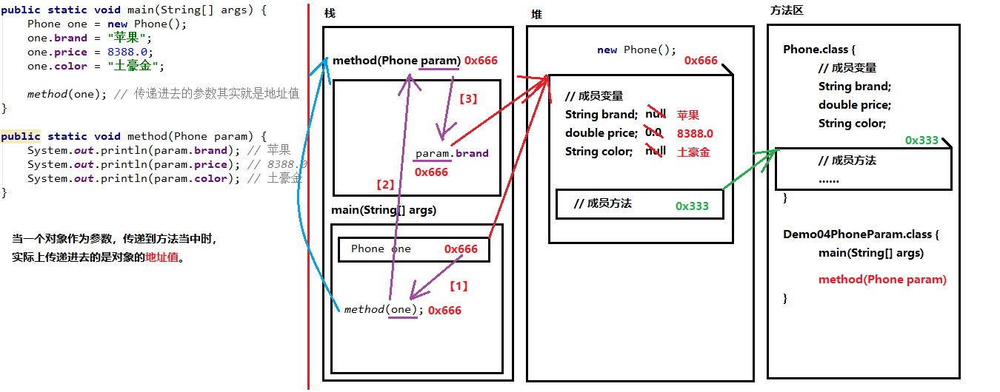

# java基础

#  *类与对象、封装、构造方法*

## 一.面向对象思想

## 1.1面向对象思想概述

###  概述

面向[对象](https://baike.baidu.com/item/对象)(Object Oriented)是[软件开发方法](https://baike.baidu.com/item/软件开发方法/971447)。面向[对象](https://baike.baidu.com/item/对象)的概念和应用已超越了[程序设计](https://baike.baidu.com/item/程序设计/223952)和软件开发，扩展到如[数据库系统](https://baike.baidu.com/item/数据库系统/215176)、交互式界面、应用结构、应用平台、[分布式系统](https://baike.baidu.com/item/分布式系统/4905336)、[网络管理](https://baike.baidu.com/item/网络管理/5903609)结构、CAD技术、[人工智能](https://baike.baidu.com/item/人工智能/9180)等领域。面向对象是一种对现实世界理解和抽象的方法，是计算机编程技术发展到一定阶段后的产物。

面向对象是相对于面向过程来讲的，面向对象方法，把相关的数据和方法组织为一个整体来看待，从更高的层次来进行系统建模，更贴近事物的自然运行模式。

###  区别

- 面向过程：强调步骤。
- 面向对象：强调对象。

### 特点

面向对象思想是一种更符合思考习惯的思想，它可以将复杂的事情简单化，并将我们从执行者变成了指挥者。

面相对象的语言中，包含了三大基本特征：***封装、继承、和多态***。

## 1.2 类和对象

### 什么是类

- **类**：是一组相关属性和行为的集合。

  >  ps:可以看作一类事物的模版,使用事物的属性特征和行为特征来描述该描述该类事物。

- 属性：事物的状态信息
- 行为：事物能干什么

### 什么是对象

- **对象**：是一类事物的具体体现。对象是类的实例化，具备该类的属性和行为。


### 类与对象关系

- 类是对一类事物的描述，是抽象的。
- 对象是一类的事物的实例，是具体的。
- 类是对象的模版，对象是类的实体。

## 1.3 类的定义

### 事物与类的对比

现实事物

- 属性：事物的状态信息
- 行为：事物能干什么

java中用class描述事物

- 成员变量：对应事物的属性
- 成员方法： 对应事物的行为

### 类的定义格式

```java
public static ClassName{
    //成员变量
    //成员方法
}
```

- **定义类**：定义类的成员，包括**成员变量**和**成员方法**
- **成员变量**：在类中、方法外的变量
- **成员方法**：没有***static***的方法

类的定义格式举例：

```java
public class Student {
    //成员变量 
    String name;
    int age;
    //成员方法
    //学习的方法
    public void dtudy() {
        System.out.println("好好学习！");
    }
    //吃饭的方法
    public void eat() {
        System.out.println("饿了要吃饭");        
    }
}

```


## 1.4对象的使用

### 对象的使用格式

创建对象：

``` java
类名 对象名 = new 类名();
```

使用对象访问类中的成员：

~~~java
对象名.成员变量;
对象名.成员方法();
~~~

对象的使用格式举例:

```java
public class TestStudent {
    public static void main(String[]args){
        //创建对象格式: 类名 对象名 = new 类名();
        Student s = new Student();
        System.out.println("S:"+s);
    }
    
    //直接输出成员变量值
    System.out.println("姓名:"+s.name);//null
    System.out.println("年龄:"+s.age);//0
    System.out.println("------------");
    
    // 改变对象当中的成员变量数值内容
        // 将右侧的字符串，赋值交给stu对象当中的name成员变量
        stu.name = "赵丽颖";
        stu.age = 18;
    //再次输出成员变量的值
        System.out.println(stu.name); // 赵丽颖
        System.out.println(stu.age); // 18
        System.out.println("=============");

        // 调用成员方法
        stu.eat();
        stu.study();    
}

```


### 成员变量的默认值

|          | 数据类型                   | 默认值   |
| -------- | -------------------------- | -------- |
| 基本类型 | 整数 (byte,short,int,long) | 0        |
|          | 浮点数 (float,double)      | 0.0      |
|          | 字符(char)                 | '\u0000' |
|          | 布尔(boolean)              | false    |
| 引用类型 | 数组,类,接口               | null     |

## 1.5对象内寸图

 **一个对象,调用一个方法**


 **两个对象,调用同一方法**


> 对象调用方时,根据对象中方法标记(地址值),去类中寻找方法信息.这样哪怕是多个对象,方法信息只保存一份,节约内存空间.

 **两个引用指向同一个对象的内存图**


 **使用对象类型作为方法的参数**



 **使用对象类型作为方法的返回值**


## 1.6成员变量和局部变量区别

> 就是根据位置不同取了两个不同的名字


- 在类中的位置不同`重点`
  - 成员变量: 类中,方法外
  - 局部变量: 方法中或者方法声明上(形式参数)
- 作用范围不一样`重点`
  - 成员变量: 类中
  - 局部变量: 方法中
- 初始值的不同`重点`
  - 成员变量: 有默认值
  - 局部变量: 没有默认值.**必须先定义,赋值,然后使用.**
- 内存中位置的不同`了解`
  - 成员变量:  堆内存
  - 局部变量:  栈内存

- 生命周期的不同`了解`
  - 成员变量: 随着对象
  - 局部变量: 随着方法

## 二.封装

## 2.1封装概述

### 概述

封装，即隐藏对象的属性和实现细节，仅对外公开接口，控制在程序中属性的读和修改的访问级别；将抽象得到的数据和行为（或功能）相结合，形成一个有机的整体，也就是将数据与操作数据的[源代码](https://baike.baidu.com/item/源代码/3814213)进行有机的结合，形成“类”，其中数据和函数都是类的成员。

### 原则

将**属性隐藏**起来,需要访问某个属性时,**提供公共方法**对其访问.

## 2.2封装的步骤

1. 使用`private`关键字来修饰成员变量.
2. 对需要访问的成员变量,提供对应的一对`get`方法`set`方法


## 2.3 封装的操作--private关键字

### private的含义

1. `private`是一个权限修饰符,代表最小权限,
2. 可以修饰成员变量和成员方法.
3. 被`private`修饰后的成员变量和成员方法,只在本类中才能访问.

### private 的使用格式

```java
private 数据类型 变量名;
```

1. 使用`private`修饰成员变量,

```java
public class Student {
    private String name;
    private int age;
}
```

2. 提供`get` `set`方法,可以访问成员变量

```java
public class Student {
    private String name;
    private int age;
    
    public void setName(String n){
		name = n;
    }
    
    public void getName(){
		return name;
    }
    
    public void setAge(int a){
		age = a;
    }

    public void getAge(){
		return age;
    }
    
}

```


> 注意:
>
> - 形参变量名不能与成员变量名重名,如果重名,会导致成员变量被隐藏,变量无法被访问,无法赋值.
> - 解决这个重名问题,使用this关键字.

## 2.4封装优化1-this关键字

### this的含义

this代表所在类的当前对象的引用(地址值),即对象自己的引用.

> ps:方法被哪个对象调用,方法中的this就代表那个对象.即谁在调用,this就代表谁.

### this使用格式

```java
this.成员变量名;
```

*使用this解决重名问题*

```java
public class Student {
    private String name;
    private int age;
    
    public void setName(String name){
		//name = name
        this.name = neme;
    }
    
    public void getName(){
		return name;
    }
    
    public void setAge(int age){
		// age = age;n
        this.age = age;
    }

    public void getAge(){
		return age;
    }
    
}
```

> ps:默认只有一个变量名时,默认也是使用this修饰,可以省略不写.

## 2.5封装优化2-构造方法

当一个对象被创建的时候,构造方法用来初始化对象,给对象的成员变量赋初始值.

> - 无论你是否自定义构造方法,所有的的类都有构造方法
>
> - java自动提供了一个无参数构造方法
> - 当自己定义了构造方法,java提供的默认无参数构造方法就会失效.

###  构造方法的定义格式

```java
修饰符 构造方法名(参数列表){
    //方法体
}
```

构造方法的写法,方法名与所在的类名相同.它没有返回值,所以不需要返回值类型,甚至不需要void.

```java
public class Student {
    private String name;
    private int age;
    
    public Student(){}
    //有参数的构造方法
    public Student(String name , int age){
        this.name = name;
        this.age = age;
    }       
}
```

### 注意

1. 如果你不写构造方法,系统会给出无参数构造方法,
2. 如果你写了,系统就不提供.
3. 构造方法可以重载,既可以定义参数,也可以不定义参数.

## 2.6标准代码-JavaBean

`JavaBean`是Java语言编写类的一种标准规范.符合JavaBean的类,要求类必须是具体的和公共的,并且有无参数的构造方法,提供用来操作成员变量的set和get方法.

```java
/*
一个标准的类通常要拥有下面四个组成部分：

1. 所有的成员变量都要使用private关键字修饰
2. 为每一个成员变量编写一对儿Getter/Setter方法
3. 编写一个无参数的构造方法
4. 编写一个全参数的构造方法

这样标准的类也叫做Java Bean
 */
public class ClassName{
    //成员变量
    //构造方法
    //无参数构造方法[必须]
    //有参数构造方法[建议]
    //成员方法
    //get()
    //set()
}
```

编写符合JavaBean规范的类,举例

学生类

```java

public class Student {
	//成员变量
    private String name; // 姓名
    private int age; // 年龄
	//构造方法
    public Student() {
    }
	
    public Student(String name, int age) {
        this.name = name;
        this.age = age;
    }
	//成员方法
    public String getName() {
        return name;
    }
	
    public void setName(String name) {
        this.name = name;
    }

    public int getAge() {
        return age;
    }

    public void setAge(int age) {
        this.age = age;
    }
}

```

测试类

```java
public class Demo01Student {

    public static void main(String[] args) {
        //无参构造
        Student stu1 = new Student();
        stu1.setName("迪丽热巴");
        stu1.setAge(20);
        System.out.println("姓名：" + stu1.getName() + "，年龄：" + stu1.getAge());
        System.out.println("=================");
		//有参构造
        Student stu2 = new Student("古力娜扎", 21);
        System.out.println("姓名：" + stu2.getName() + "，年龄：" + stu2.getAge());
        stu2.setAge(22);
        System.out.println("姓名：" + stu2.getName() + "，年龄：" + stu2.getAge());
    }

}
```


# *继承与多态*

## 继承,super,this,抽象类

### 第一章 继承

#### 1.1概述

##### 由来

多个类中存在相同的属性和行为,将这些内容抽取到单独的一个类中

其他不用再定义同样的属性和方法,只要继承那一个类就可以了.


其中,多个类可以称之为**子类,**单独那一个类称为**父类,超类**或着**基类**

继承描述的是事物之间的所属关系.

父类更通用,子类更具体.通过继承,使多种事物之间形成一种关系体系.

##### 定义

- **继承**: 就是子类继承父类的属性和行为,使子类对象具有父类相同的属性和方法.子类可以直接访问父类中**非私有**的属性和方法.

##### 好处

1. 提高代码的复用性
2. 类与类之间有了关系,是**多态的前提.**

#### 1.2继承的格式

通过`extens`关键字,可以声明一个子类继承另一个父类

```java
class 父类{
    ...
}

class 子类 extens 父类{
    ...
}
```

继承代码举例

```java
// 定义一个父类：员工
public class Employee {

    public void method() {
        System.out.println("方法执行！");
    }

}

// 定义了一个员工的子类：讲师
public class Teacher extends Employee {

}

// 定义了员工的另一个子类：助教
public class Assistant extends Employee {
}


public class Demo01Extends {

    public static void main(String[] args) {
        // 创建了一个子类对象
        Teacher teacher = new Teacher();
        // Teacher类当中虽然什么都没写，但是会继承来自父类的method方法。
        teacher.method();

        // 创建另一个子类助教的对象
        Assistant assistant = new Assistant();
        assistant.method();
    }

}


```

#### 1.3 继承后的特点-成员变量

当类之间有了关系,其中各类中的成员变量,也产生了变化

##### 成员变量不重名

如果子类父类中出现不重名的成员变量,这时的访问是没有影响的.

```java
class Fu{
    //Fu中的成员变量
    int num = 5;
    
}

class Zi extends Fu {
    //Zi中的成员变量
    int num2 = 6;
    //Zi中的成员方法
   public void show(){
       //访问父类中的num
       System.out.println("Fu num="+num);//继承而来,所以直接访问.
       //访问子类中大的num2
       System.out.println("Fu num="+num2);      
       
   }
}
class EctendDemo02{
    public static void main(String [] args)｛
        
        //创建子类对象
        Zi z = new Zi();
       // 调用子类中的show方法
        z.show();
        ｝
}

```


