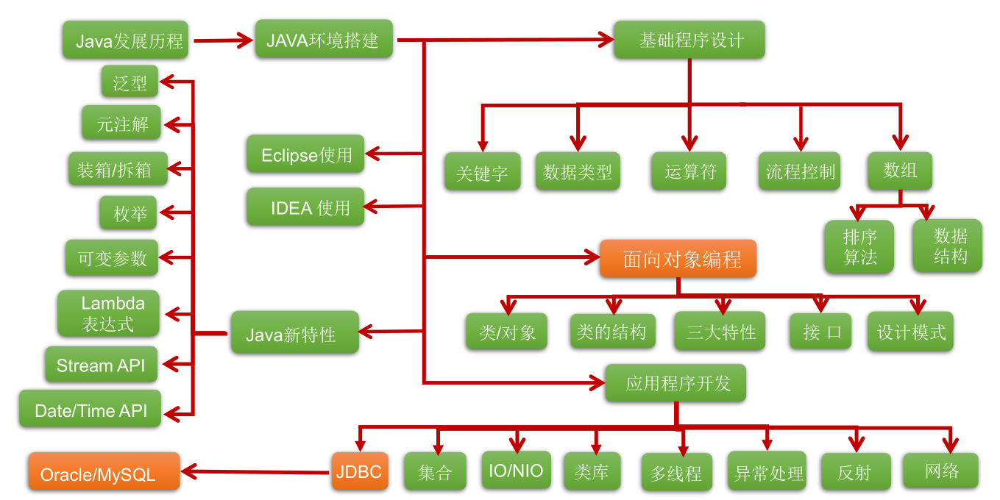
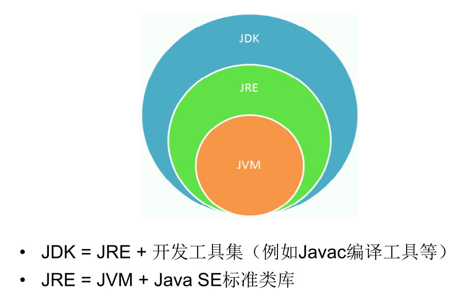

# java语言概述

## 学习路线

## java主要特性

**Java 语言是易学的**。Java语言的语法与C语言和C++语言很接近，使得大多数程序员
很容易学习和使用Java。
**Java 语言是强制面向对象的**。Java语言提供类、接口和继承等原语，为了简单起见，
只支持类之间的单继承，但支持接口之间的多继承，并支持类与接口之间的实现机制
（关键字为implements）。
**Java 语言是分布式的**。Java语言支持Internet应用的开发，在基本的Java应用编
程接口中有一个网络应用编程接口（java net），它提供了用于网络应用编程的类
库，包括URL、URLConnection、Socket、ServerSocket等。Java的RMI（远程
方法激活）机制也是开发分布式应用的重要手段。
**Java 语言是健壮的**。Java的强类型机制、异常处理、垃圾的自动收集等是Java程序
健壮性的重要保证。对指针的丢弃是Java的明智选择。
 **Java 语言是安全的**。Java通常被用在网络环境中，为此，Java提供了一个安全机
制以防恶意代码的攻击。如：安全防范机制（类ClassLoader），如分配不同的
名字空间以防替代本地的同名类、字节代码检查。
**Java 语言是体系结构中立的**。Java程序（后缀为java的文件）在Java平台上被
编译为体系结构中立的字节码格式（后缀为class的文件），然后可以在实现这个
Java平台的任何系统中运行。
**Java 语言是解释型的**。如前所述，Java程序在Java平台上被编译为字节码格式，
然后可以在实现这个Java平台的任何系统的解释器中运行。
**Java 是性能略高的**。与那些解释型的高级脚本语言相比，Java的性能还是较优的。
**Java 语言是原生支持多线程的**。在Java语言中，线程是一种特殊的对象，它必须
由Thread类或其子（孙）类来创建。

### java的两个核心机制

jvm虚拟机

java的垃圾回收机制

## jdk与jre

jdk环境配置

新建 系统变量 JAVA_HOME=java的安装目录      在path中添加%JAVA_HOME%\bin  然后重启变量生效

