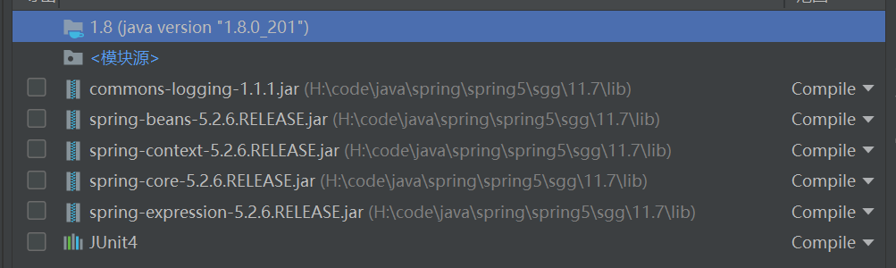
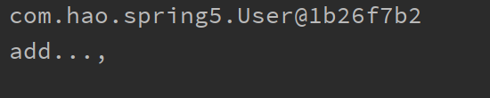
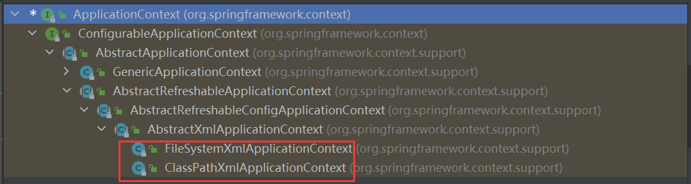

# 1.Spring5概述

1.Spring是轻量级的开源JavaEE框架

2.Spring可以解决企业应用开发的复杂性

3.Spring有两个核心的部分：IOC和Aop

- IOC:控制反转，把创建对象的过程交给Spring进行管理
- Aop:面向切面，不修改源代码，进行系统增强

<!--more-->

4.Spring特点

-  方便解耦，简化开发

- Aop编程支持

- 方便程序测试

- 方便和其他框架整合

- 方便进行事务操作

- 降低api开发难度

  

## 1.1Spring入门案例

1.在https://repo.spring.io/release/org/springframework/spring/5.2.6.RELEASE/下载Spring5

2.在idea中新建普通的java工程

3.导入Spring5相关的jar包



4 .创建普通User类，在这个类创建普通方法

```java
public class User {

    public void add() {
        System.out.println("add...,");
        
    }
}
```

5.创建Spring配置文件，在配置文件中配置创建的对象

- src目录下新建bean1.xml

  ```xml
  <?xml version="1.0" encoding="UTF-8"?>
  <beans xmlns="http://www.springframework.org/schema/beans"
         xmlns:xsi="http://www.w3.org/2001/XMLSchema-instance"
         xsi:schemaLocation="http://www.springframework.org/schema/beans http://www.springframework.org/schema/beans/spring-beans.xsd">
      <!--配置User对象创建-->
      <bean id="user" class="com.hao.spring5.User"></bean>
  </beans>
  ```

6.编写测试代码

```java
@Test
public void testAdd(){
  //1加载spring加载文件
  ApplicationContext context =
    new ClassPathXmlApplicationContext("bean1.xml");

  //2 获取配置创建的对象
  User user = context.getBean("user", User.class);
  System.out.println(user);
  user.add();
}
```

7.运行



# 2.IOC

## 2.1IOC概念和原理

1.什么是IOC

- 控制反转，把对象的创建和对象之间的调用过程，交给spring进行管理
- 使用IOC目的，为了耦合度降低

2.IOC底层原理

- xml解析、工厂模式、反射

3.ioc底层原理


IOC过程


Spring中的IOC（BeanFactory接口）

1、IOC 思想基于 IOC 容器完成，IOC 容器底层就是对象工厂
2、Spring 提供 IOC 容器实现两种方式：（两个接口）

- BeanFactory：IOC 容器基本实现，是 Spring 内部的使用接口，不提供开发人员进行使用加载配置文件时候不会创建对象，在获取对象（使用）才去创建对象
- ApplicationContext：BeanFactory 接口的子接口，提供更多更强大的功能，一般由开发人员进行使用加载配置文件时候就会把在配置文件对象进行创建

3、ApplicationContext 接口有两个实现类



## 2.2IOC操作Bean管理

1.什么是Bean管理

- Bean管理指的是两个操作
  - Spring创建对象
  - Spring注入属性

2.Bean管理操作有两种方式

- 基于xml配置文件方式实现
- 基于注解实现

## 2.3IOC操作Bean管理-基于xml方式

1.基于xml方式创建对象

```xml
<!--配置User对象创建-->
<bean id="user" class="com.hao.spring5.User"></bean>
```

- 在 spring 配置文件中，使用 bean 标签，标签里面添加对应属性，就可以实现对象创建

- 在 bean 标签有很多属性，介绍常用的属性

  - id 属性：唯一标识

  - class 属性：类全路径（包类路径）

- 创建对象时候，默认也是执行无参数构造方法完成对象创建

2.基于xml方式注入属性

​	（1）DI：依赖注入，就是注入属性

### 2.3.1注入属性

> 使用set方法进行注入

1.创建类，定义属性和对应的set方法

```java
public class Book {

    private String bname;
    private String bauthor;
    //set方法注入
    public void setBname(String bname) {
        this.bname = bname;
    }

    public void setBauthor(String bauthor) {
        this.bauthor = bauthor;
    }

    public void testDemo(){
        System.out.println(bname+"::"+bauthor);
    }

}
```

2.在spring配置文件中配置对象的创建，配置属性注入

```xml
<!--set方法注入属性-->
<bean id="book" class="com.hao.spring5.Book">
  <!--使用property完成属性的注入-->
  <property name="bname" value="java从入门到放弃"></property>
  <property name="bauthor" value="郝大胖"></property>
</bean>
```

> 使用有参构造进行注入

1.创建类，定义属性，创建属性对应有参数构造方法

```java
//使用有参数构造注入
public class Orders {
  private String oname;
  private String address;
  public Orders(String oname,String address){
    this.oname = oname;
    this.address = address;
  }

}
```

2.在spring配置文件中进行配置

```xml
<!--有参数构造注入属性-->
<bean id="orders" class="com.hao.spring5.Orders">
  <constructor-arg name="oname" value="牙刷"></constructor-arg>
  <constructor-arg name="address" value="天津"></constructor-arg>
</bean>
```

> p名称空间注入（了解）

使用p名称空间注入，可以简化基于xml配置方式

1.添加p名称空间在配置文件中

```xml
xmlns:p="http://www.springframework.org/schema/p"
```

2.进行属性注入，在bean标签里边进行操作

```xml
 <bean id="book" class="com.hao.spring5.Book" p:bname="解密jvm" p:bauthor="郝大胖"></bean>
```

### 2.3.2注入其他类型属性

>  字面量

- null值

  ```xml
  <!--set方法注入属性-->
  <bean id="book" class="com.hao.spring5.Book">
    <!--使用property完成属性的注入-->
    <property name="bname" value="java从入门到放弃"></property>
    <property name="bauthor" value="郝大胖"></property>
    <!--null值-->
    <property name="address" >
      <null/>
    </property>
  </bean>
  ```

  

- 属性值包含特殊符号

  ```xml
  <!--属性值包含特殊符号
   1.对特殊符号进行转义&lt; &gt:
   2.把特殊符号写到CDATA中
   -->
  <property name="address" >
    <value><![CDATA[<<天津>>]]></value>
  </property>
  ```

> 外部bean

1.创建两个类service类和dao类

2.在service调用dao里边的方法

```java
public class UserService {

    //创建UserDao类型属性，生成set方法
    private UserDao userDao;

    public void setUserDao(UserDao userDao) {
        this.userDao = userDao;
    }

    public void add(){
        System.out.println("service add ...");
        userDao.update();
    }
}
```


3.在spring配置文件中经进行配置

```xml
<!-- 1.service和dao对象的创建   -->
<bean id="userService" class="com.hao.spring5.service.UserService">
  <!--注入userDao对象
        name属性值：类里边的属性名称
        ref属性：创建userDao对象bean标签的id值
    -->
  <property name="userDao" ref="userDaoImpl"></property>

</bean>
<bean id="userDaoImpl" class="com.hao.spring5.dao.UserDaoImpl"></bean>
```


> 内部bean和级联赋值

