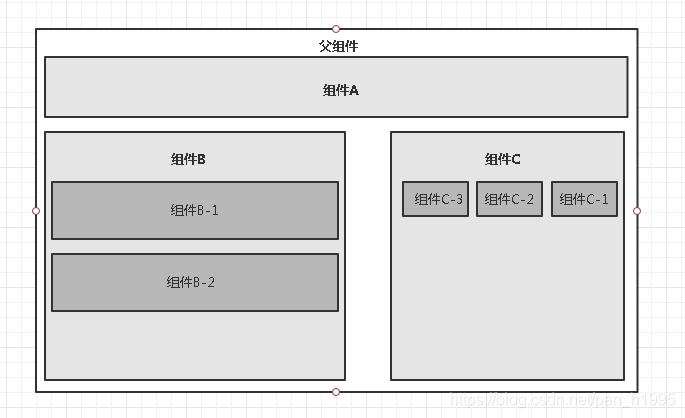
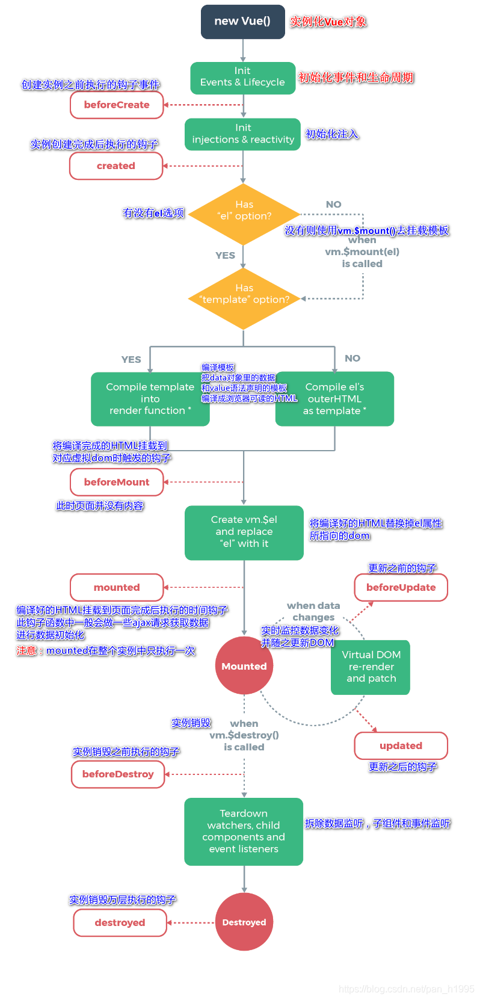

# 1.vue 概述

html +css+js 视图 ：给用户看，刷新后台给的数据

网络通信 ：axios

页面跳转：vue -router

状态管理：vuex

Vue-UI: ice

webpack 打包

mvvm vm数据双向绑定

虚拟dom：利用内存

大前端时代

## 1.1、什么是MVVM

​		MVVM（Model-View-ViewModel）是一种软件设计模式，由微软WPF（用于替代WinForm，以前就是用这个技术开发桌面应用程序的）和Silverlight（类似于Java Applet，简单点说就是在浏览器上运行WPF）的架构师Ken Cooper和Ted Peters开发，是一种简化用户界面的**事件驱动编程方式**。由John Gossman（同样也是WPF和Sliverlight的架构师）与2005年在他的博客上发表。

  MVVM源自于经典的MVC（Model-View-Controller）模式。MVVM的核心是ViewModel层，负责转换Model中的数据对象来让数据变得更容易管理和使用。其作用如下：

- 该层向上与视图层进行双向数据绑定
- 向下与Model层通过接口请求进行数据交互


MVVM已经相当成熟了，主要运用但不仅仅在网络应用程序开发中。当下流行的MVVM框架有`Vue.js`，`Anfular JS`

## 1.2、为什么要使用MVVM

MVVM模式和MVC模式一样，主要目的是分离视图（View）和模型（Model），有几大好处

- **低耦合**： 视图（view）可以独立于Model变化和修改，一个ViewModle可以绑定到不同的View上，当VIew变化的时候Modle可以不变，当Model变化的时候View也可以不变
- **可复用**：可以把一些视图逻辑放置在ViewModle里边，让很多View重用这段视图
- **独立开发**：开发人员专注于业务逻辑和数据的开发（ViewMode）,设计人员专注于页面设计
- 容易测试：界面元素难以测试，现在可以针对viewmode来写测试代码


>  view

View是视图层， 也就是用户界面。前端主要由HTH L和csS来构建， 为了更方便地展现vi eu to del或者Hodel层的数据， 已经产生了各种各样的前后端模板语言， 比如FreeMarker，Thyme leaf等等， 各大MV VM框架如Vue.js.Angular JS， EJS等也都有自己用来构建用户界面的内置模板语言。

> Model

Model是指数据模型， 泛指后端进行的各种业务逻辑处理和数据操控， 主要围绕数据库系统展开。这里的难点主要在于需要和前端约定统一的接口规则

> ViewModel

ViewModel是由前端开发人员组织生成和维护的视图数据层。在这一层， 前端开发者对从后端获取的Model数据进行转换处理， 做二次封装， 以生成符合View层使用预期的视图数据模型。
  需要注意的是View Model所封装出来的数据模型包括视图的状态和行为两部分， 而Model层的数据模型是只包含状态的

- 比如页面的这一块展示什么，那一块展示什么这些都属于视图状态(展示)
- 页面加载进来时发生什么，点击这一块发生什么，这一块滚动时发生什么这些都属于视图行为(交互)

  视图状态和行为都封装在了View Model里。这样的封装使得View Model可以完整地去描述View层。由于实现了双向绑定， View Model的内容会实时展现在View层， 这是激动人心的， 因为前端开发者再也不必低效又麻烦地通过操纵DOM去更新视图。
  MVVM框架已经把最脏最累的一块做好了， 我们开发者只需要处理和维护View Model， 更新数据视图就会自动得到相应更新，真正实现`事件驱动编程`。
  View层展现的不是`Model`层的数据， 而是`ViewModel`的数据， 由`ViewModel`负责与`Model`层交互， 这就**完全解耦了View层和Model层， 这个解耦是至关重要的， 它是前后端分离方案实施的重要一环。**

## 1.3、什么是Vue

Vue(读音/vju/， 类似于view) 是一套用于构建用户界面的渐进式框架， 发布于2014年2月。与其它大型框架不同的是， Vue被设计为可以自底向上逐层应用。Vue的核心库只关注视图层， 不仅易于上手， 还便于与第三方库(如：vue-router，vue-resource，vue x) 或既有项目整合。

> MVVM模式的实现者

- Model：模型层， 在这里表示JavaScript对象
- View：视图层， 在这里表示DOM(HTML操作的元素)
- ViewModel：连接视图和数据的中间件， Vue.js就是MVVM中的View Model层的实现者

  在MVVM架构中， 是不允许数据和视图直接通信的， 只能通过ViewModel来通信， 而View Model就是定义了一个Observer观察者

- ViewModel能够观察到数据的变化， 并对视图对应的内容进行更新
- ViewModel能够监听到视图的变化， 并能够通知数据发生改变

  至此， 我们就明白了， Vue.js就是一个MV VM的实现者， 他的核心就是实现了DOM监听与数据绑定

> 为什么使用Vue.js

- 轻量级， 体积小是一个重要指标。Vue.js压缩后有只有20多kb(Angular压缩后56kb+，React压缩后44kb+)
- 移动优先。更适合移动端， 比如移动端的Touch事件
- 易上手，学习曲线平稳，文档齐全
- 吸取了Angular(模块化) 和React(虚拟DOＭ) 的长处， 并拥有自己独特的功能，如：计算属性
- 开源，社区活跃度高

## 1.4、第一个Vue程序

【说明】IDEA可以安装Vue的插件!
注意：Vue不支持IE 8及以下版本， 因为Vue使用了IE 8无法模拟的ECMAScript 5特性。但它支持所有兼容ECMAScript 5的浏览器。

**下载版本**

- 开发版本
  - 包含完整的警告和调试模式：https：//yuejs.org/js/vue.js
  - 删除了警告， 30.96KBmin+gzip：https：//vuejs.org/js/vue.min.js
- CDN
  - `<script src=“https://cdn.jsdelivr.net/npm/vue@2.5.21/dist/vue.js”></script>`
  - `<script src="https://cdn.jsdelivr.net/npm/vue@2.5.21/dist/vue.min.js"></script>`


第一个程序

```html
<!DOCTYPE html>
<html lang="en">
<head>
    <meta charset="UTF-8">
    <title>Title</title>

</head>hello2
<body>
<h1>郝大胖</h1>
<!--view层变成了模板-->
<div id="app">
        {{message}}
</div>


<!--导入vue.js-->
<script src="https://cdn.jsdelivr.net/npm/vue@2.5.16/dist/vue.js"></script>
<script>
    var vm = new Vue({
        el: "#app",
        //modle,数据
        data: {
            message: "hello,vue!"
        }
    })
</script>

</body>
</html>
```

- `el: '#vue'`：绑定元素的ID
- `data:{message:'Hello Vue!'}`：数据对象中有一个名为message的属性，并设置了初始值 Hello Vue！

说明：只需要在绑定的元素中使用双花括号将Vue创建的名为message属性包裹起来， 即可实现数据绑定功能， 也就实现了View Model层所需的效果， 是不是和EL表达式非常像?

> 浏览器测试

为了能够更直观的体验Vue带来的数据绑定功能， 我们需要在浏览器测试一番， 操作流程如下：
  1、在浏览器上运行第一个Vue应用程序， 进入开发者工具
  2、在控制台输入vm.message=‘HelloWorld’， 然后回车， 你会发现浏览器中显示的内容会直接变成HelloWorld
  此时就可以在控制台直接输入vm.message来修改值， 中间是可以省略data的， 在这个操作中， 我并没有主动操作DOM， 就让页面的内容发生了变化， 这就是借助了Vue的数据绑定功能实现的； MV VM模式中要求View Model层就是使用观察者模式来实现数据的监听与绑定， 以做到数据与视图的快速响应。

# 2.基础语法指令

## 2.1、v-bind

我们已经成功创建了第一个Vue应用!看起来这跟渲染一个字符串模板非常类似， 但是Vue在背后做了大量工作。现在数据和DOM已经被建立了关联， 所有东西都是响应式的。我们在控制台操作对象属性，界面可以实时更新!
我们还可以使用v-bind来绑定元素特性!

```html
<!DOCTYPE html>
<html lang="en" xmlns:v-bind="http://www.w3.org/1999/xhtml">
<head>
    <meta charset="UTF-8">
    <title>Title</title>

</head>
<body>
<h1>郝大胖</h1>
<!--view层变成了模板-->
<div id="app">
    <span v-bind:title="message">
    鼠标悬停几秒
    </span>
</div>


<!--导入vue.js-->
<script src="https://cdn.jsdelivr.net/npm/vue@2.5.16/dist/vue.js"></script>
<script>
    var vm = new Vue({
        el: "#app",
        //modle,数据
        data: {
            message: "hello,vue!"
        }
    })
</script>

</body>
</html>
```

​			你看到的v-bind等被称为指令。指令带有前缀v以表示它们是Vue提供的特殊特性。可能你已经猜到了， 它们会在渲染的DOM上应用特殊的响应式行为在这里，该指令的意思是：“将这个元素节点的title特性和Vue实例的message属性保持一致”。
  如果你再次打开浏览器的JavaScript控制台， 输入app， message=‘新消息’，就会再一次看到这个绑定了title特性的HTML已经进行了更新。

## 2.2、v-if v-else


```html
<!DOCTYPE html>
<html lang="en" xmlns:v-bind="http://www.w3.org/1999/xhtml">
<head>
    <meta charset="UTF-8">
    <title>Title</title>

</head>
<body>
<h1>郝大胖</h1>
<!--view层变成了模板-->
<div id="app">
   <h1 v-if="type==='A'">A</h1>
   <h1 v-else-if="type==='B'">B</h1>
   <h1 v-else-if="type==='C'">C</h1>
   <h1 v-else>D</h1>
</div>


<!--导入vue.js-->
<script src="https://cdn.jsdelivr.net/npm/vue@2.5.16/dist/vue.js"></script>
<script>
    var vm = new Vue({
        el: "#app",
        //modle,数据
        data: {
            type: 'A'
        }
    })
</script>

</body>
</html>
```

注：`===`三个等号在JS中表示绝对等于(就是数据与类型都要相等)上代码：

## 2.3、v-for

格式说明

`items`是数组，`item`是数组元素迭代的别名。我们之后学习的Thymeleaf模板引擎的语法和这个十分的相似！

```html
<div id="app">
    <li v-for="(item,index) in items">
        {{item.message}}---{{index}}
    </li>

</div>
```


```html
<!DOCTYPE html>
<html lang="en" xmlns:v-bind="http://www.w3.org/1999/xhtml">
<head>
    <meta charset="UTF-8">
    <title>Title</title>

</head>
<body>
<h1>郝大胖</h1>
<!--view层变成了模板-->
<div id="app">
    <li v-for="item in items">
        {{item.message}}---{{index}}
    </li>
</div>


<!--导入vue.js-->
<script src="https://cdn.jsdelivr.net/npm/vue@2.5.16/dist/vue.js"></script>
<script>
    var vm = new Vue({
        el: "#app",
        //modle,数据
        data: {
            items:[
                {message:'郝大胖'},
                {message:'啦啦啦'},
                {message:'呀呀呀'}

            ]
        }
    })
</script>

</body>
</html>
```

在控制台输入`vm.items.push({message：'你好呀'})`，尝试追加一条数据，你会发现浏览器中显示的内容会增加一条 你好呀.

## 2.4、v-on

`v-on`监听事件
 事件有Vue的事件、和前端页面本身的一些事件!我们这里的`click`是vue的事件， 可以绑定到Vue中的`methods`中的方法事件!

```html
<!DOCTYPE html>
<html lang="en" xmlns:v-on="http://www.w3.org/1999/xhtml">
<head>
    <meta charset="UTF-8">
    <title>Title</title>

</head>
<body>

<div id="app">
<button v-on:click="sayHi">点我</button>
</div>


<!--导入vue.js-->
<script src="https://cdn.jsdelivr.net/npm/vue@2.5.16/dist/vue.js"></script>
<script>
    var vm = new Vue({
        el: "#app",

        data: {
            message:"郝大胖"
        },
        methods:{//方法必须定义在Vue的Methods对象中
            sayHi: function (){
                alert(this.message);
            }

        }

    })
</script>

</body>
</html>
```

Vue还有一些基本的使用方式， 大家有需要的可以再跟着官方文档看看https://cn.vuejs.org/

# 3.表单双向数据绑定

## 3.1、什么是双向数据绑定

​		Vue.js是一个MV VM框架， 即数据双向绑定， 即当数据发生变化的时候， 视图也就发生变化， 当视图发生变化的时候，数据也会跟着同步变化。这也算是Vue.js的精髓之处了。
  值得注意的是，我们所说的数据双向绑定，一定是对于UI控件来说的非UI控件不会涉及到数据双向绑定。单向数据绑定是使用状态管理工具的前提。如果我们使用vue x那么数据流也是单项的，这时就会和双向数据绑定有冲突。

**为什么要实现数据的双向绑定？**

在`Vue.js`中，如果使用`vuex`， 实际上数据还是单向的， 之所以说是数据双向绑定，这是用的UI控件来说， 对于我们处理表单， `Vue.js`的双向数据绑定用起来就特别舒服了。即两者并不互斥，在全局性数据流使用单项，方便跟踪；局部性数据流使用双向，简单易操作。

## 3.2、在表单中使用双向数据绑定

  可以用`v-model`指令在表单、及元素上创建双向数据绑定。它会根据控件类型自动选取正确的方法来更新元素。尽管有些神奇， 但`v-model`本质上不过是语法糖。它负责监听用户的输入事件以更新数据，并对一些极端场景进行一些特殊处理。
  注意：`v-model`会忽略所有表单元素的`value`、`checked`、`selected`特性的初始值而总是将`Vue`实例的数据作为数据来源。你应该通过`JavaScript`在组件的`data`选项中声明初始值!

1.单行文本

```html
<!DOCTYPE html>
<html lang="en">
<head>
    <meta charset="UTF-8">
    <title>Title</title>
</head>
<body>
<div id="app">
    输入的文本：<input type="text" v-model="message" value="hello">{{message}}
</div>

<script src="../js/vue.js"></script>
<script type="text/javascript">
    var vm = new Vue({
        el:"#app",
        data:{
            message:""
        }
    });
</script>
</body>
</html>

```

2.多行文本

```html
<!DOCTYPE html>
<html lang="en">
<head>
    <meta charset="UTF-8">
    <title>Title</title>
</head>
<body>
<div id="app">
   多行文本：<textarea v-model="pan"></textarea>&nbsp;&nbsp;多行文本是：{{pan}}
</div>

<script src="../js/vue.js"></script>
<script type="text/javascript">
    var vm = new Vue({
        el:"#app",
        data:{
            message:"Hello hello!"
        }
    });
</script>
</body>
</html>
```

3.单复选框

```html
<!DOCTYPE html>
<html lang="en">
<head>
    <meta charset="UTF-8">
    <title>Title</title>
</head>
<body>

<div id="app">
    单复选框：
    <input type="checkbox" id="checkbox" v-model="checked">
    &nbsp;&nbsp;
    <label for="checkbox">{{checked}}</label>
</div>

<script src="../js/vue.js"></script>
<script type="text/javascript">
    var vm = new Vue({
        el:"#app",
        data:{
            checked:false
        }
    });
</script>
</body>
</html>
```

4.多复选框

```html
<!DOCTYPE html>
<html lang="en">
<head>
    <meta charset="UTF-8">
    <title>Title</title>
</head>
<body>

<div id="app">
    多复选框：
    <input type="checkbox" id="jack" value="Jack" v-model="checkedNames">
    &nbsp;&nbsp;
    <label for="jack">Jack</label>
    <input type="checkbox" id="join" value="Join" v-model="checkedNames">
    &nbsp;&nbsp;
    <label for="join">Jack</label>
    <input type="checkbox" id="mike" value="Mike" v-model="checkedNames">
    &nbsp;&nbsp;
    <label for="mike">Mike</label>
    <span>选中的值：{{checkedNames}}</span>
</div>

<script src="../js/vue.js"></script>
<script type="text/javascript">
    var vm = new Vue({
        el:"#app",
        data:{
            checkedNames:[]
        }
    });
</script>
</body>
</html>
```

5.单选按钮

```html
<!DOCTYPE html>
<html lang="en">
<head>
    <meta charset="UTF-8">
    <title>Title</title>
</head>
<body>

<div id="app">
    单选框按钮
    <input type="radio" id="one" value="One" v-model="picked">
    <label for="one">One</label>
    <input type="radio" id="two" value="Two" v-model="picked">
    <label for="two">Two</label>
    <span>选中的值：{{picked}}</span>
</div>

<script src="../js/vue.js"></script>
<script type="text/javascript">
    var vm = new Vue({
        el:"#app",
        data:{
            picked:'Two'
        }
    });
</script>
</body>
</html>
```

6.下拉框

```html
<!DOCTYPE html>
<html lang="en">
<head>
    <meta charset="UTF-8">
    <title>Title</title>
</head>
<body>
<div id="app">

    下拉框:
    <select v-model="pan">
        <option value="" disabled>---请选择---</option>
        <option>A</option>
        <option>B</option>
        <option>C</option>
        <option>D</option>
    </select>
    <span>value:{{pan}}</span>


</div>

<script src="../js/vue.js"></script>
<script type="text/javascript">
    var vm = new Vue({
        el:"#app",
        data:{
            pan:"A"
        }
    });
</script>
</body>
</html>
```

注意：`v-model`表达式的初始值未能匹配任何选项，元系将被渲染为“未选中”状态。 在iOS中， 这会使用户无法选择第一个选项，因为这样的情况下，iOS不会触发`change`事件。因此，更推荐像上面这样提供一个值为空的禁用选项。

# 4.组件

## 4.1、什么是组件

组件是可复用的`Vue`实例， 说白了就是一组可以重复使用的模板， 跟`JSTL`的自定义标签、`Thymeleal`的`th:fragment`等框架有着异曲同工之妙，通常一个应用会以一棵嵌套的组件树的形式来组织：




例如，你可能会有页头、侧边栏、内容区等组件，每个组件又包含了其它的像导航链接、博文之类的组件。

## 4.2、第一个组件

注意：在实际开发中，我们并不会用以下方式开发组件，而是采用`vue-cli`创建，`vue`模板文件的方式开发，以下方法只是为了让大家理解什么是组件。

**使用`Vue.component()`方法注册组件，格式如下：**

```html
<div id="app">
  <pan></pan>
</div>

<script src="../js/vue.js"></script>
<script type="text/javascript">
    //先注册组件
    Vue.component("pan",{
        
        template:'<li>Hello</li>'

    });
    //再实例化Vue
    var vm = new Vue({
        el:"#app",
    });
</script>

```

说明：

- `Vue.component()`：注册组件
- `pan`：自定义组件的名字
- `template`：组件的模板

## 4.3、使用props传递参数

像上面那样用组件没有任何意义，所以我们是需要传递参数到组件的，此时就需要使用`props`属性了！
**注意：默认规则下props属性里的值不能为大写；**

```html
<!DOCTYPE html>
<html lang="en" xmlns:v-on="http://www.w3.org/1999/xhtml">
<head>
    <meta charset="UTF-8">
    <title>Title</title>

</head>
<body>

<div id="app">
<!--    组件，传递给组件中的值：props-->
    <hao v-for="item in items" v-bind:haodapang="item"></hao>

</div>


<!--导入vue.js-->
<script src="https://cdn.jsdelivr.net/npm/vue@2.5.21/dist/vue.js"></script>
<script>
    //定义一个Vue组件component
    Vue.component("hao",{
        props: ['haodapang'],
        template: '<li>{{haodapang}}</li>'

    });
    var vm = new Vue({
        el: "#app",
        data:{
            items: ["java","linux","前端"]
        }

    });
</script>

</body>
</html>
```

**说明**：

- `v-for="item in items"`：遍历`Vue`实例中定义的名为`items`的数组，并创建同等数量的组件
- `v-bind:haodapang="item"`：将遍历的`item`项绑定到组件中`props`定义名为`item`属性上；= 号左边的`haodapang`为`props`定义的属性名，右边的为`item in items` 中遍历的item项的值

# 5.Axios异步通信

## 5.1、什么是Axios

Axios是一个开源的可以用在浏览器端和`Node JS`的异步通信框架， 她的主要作用就是实现AJAX异步通信，其功能特点如下：

- 从浏览器中创建`XMLHttpRequests`
- 从node.js创建http请求
- 支持Promise API[JS中链式编程]
- 拦截请求和响应
- 转换请求数据和响应数据
- 取消请求
- 自动转换JSON数据
- 客户端支持防御XSRF(跨站请求伪造)

  GitHub：https://github.com/axios/axios
  中文文档：http://www.axios-js.com/

> 为什么要使用Axios

由于`Vue.js`是一个视图层框架并且作者(尤雨溪) 严格准守SoC(关注度分离原则)所以`Vue.js`并不包含AJAX的通信功能， 为了解决通信问题， 作者单独开发了一个名为`vue-resource`的插件， 不过在进入2.0版本以后停止了对该插件的维护并推荐了`Axios`框架。少用jQuery， 因为它操作Dom太频繁!

## 5.2、第一个Axios应用程序

咱们开发的接口大部分都是采用JSON格式， 可以先在项目里模拟一段JSON数据， 数据内容如下：创建一个名为data.json的文件并填入上面的内容， 放在项目的根目录下

```json
{
  "name": "郝大胖",
  "url": "https://blog.jianso.tech/",
  "page": 1,
  "isNonProfit": true,
  "address": {
    "street": "光荣道",
    "city": "天津",
    "country": "中国"
  }

}

```

测试代码

```html
<!DOCTYPE html>
<html lang="en">
<head>
    <meta charset="UTF-8">
    <title>Title</title>
</head>
<body>

<div id="vue">
    <div>名字：{{info.name}}</div>
    <div>地址：{{info.address.street}}</div>
    <div>链接：<a v-binf:href="info.url" target="_blank">{{info.url}}</a> </div>
</div>

<!--引入js文件-->
<script src="https://cdn.jsdelivr.net/npm/vue@2.5.21/dist/vue.js"></script>
<script src="https://unpkg.com/axios/dist/axios.min.js"></script>
<script type="text/javascript">
    var vm = new Vue({
        el:"#vue",
        //data: 属性 data方法
        data(){
            return{
                //请求的返回参数格适，必须和json字符串一样
                info:{
                    name: null,
                    address: {
                        street: null,
                        city: null,
                        country: null
                    }

                }

            }

        },
        mounted(){//钩子函数 链式编程 es6新特性
            axios.get('data.json').then(response=>{this.info=(response.data)})

        }
    });

</script>
</body>
</html>
```

说明：

1. 在这里使用了v-bind将a:href的属性值与Vue实例中的数据进行绑定
2. 使用axios框架的get方法请求AJAX并自动将数据封装进了Vue实例的数据对象中
3. 我们在data中的数据结构必须和`Ajax`响应回来的数据格式匹配！

## 5.3、Vue的生命周期

    官方文档：https://cn.vuejs.org/v2/guide/instance.html#生命周期图示
  Vue实例有一个完整的生命周期，也就是从开始创建初女台化数据、编译模板、挂载DOM、渲染一更新一渲染、卸载等一系列过程，我们称这是Vue的生命周期。通俗说就是Vue实例从创建到销毁的过程，就是生命周期。
  在Vue的整个生命周期中，它提供了一系列的事件，可以让我们在事件触发时注册JS方法，可以让我们用自己注册的JS方法控制整个大局，在这些事件响应方法中的this直接指向的是Vue的实例。




# 6.计算属性、内容分发、自定义事件

## 6.1、什么是计算属性

计算属性的重点突出在`属性`两个字上(属性是名词)，首先它是个`属性`其次这个属性有`计算`的能力(计算是动词)，这里的`计算`就是个函数：简单点说，它就是一个能够将计算结果缓存起来的属性(将行为转化成了静态的属性)，仅此而已；可以想象为缓存!

代码

```html
<!DOCTYPE html>
<html lang="en">
<head>
    <meta charset="UTF-8">
    <title>Title</title>
</head>
<body>
<!--view层，模板-->
<div id="app">
    <p>currentTime1:{{currentTime1()}}</p>
    <p>currentTime2:{{currentTime2}}</p>
</div>

<!--1.导入Vue.js-->
<script src="https://cdn.jsdelivr.net/npm/vue@2.5.21/dist/vue.min.js"></script>
<script type="text/javascript">
    var vm = new Vue({
        el:"#app",
        data:{
          message:"pan"
        },
        methods:{
            currentTime1:function(){
                return Date.now();//返回一个时间戳
            }
        },
        computed:{
            currentTime2:function(){//计算属性：methods，computed方法名不能重名，重名之后，只会调用methods的方法
                this.message;
                return Date.now();//返回一个时间戳
            }
        }
    });
</script>
</body>
</html>

```

 注意：methods和computed里的东西不能重名

> 说明： 

- methods：定义方法， 调用方法使用currentTime1()， 需要带括号

- computed：定义计算属性， 调用属性使用currentTime2， 不需要带括号：this.message是为了能够让currentTime2观察到数据变化而变化

- 如何在方法中的值发生了变化，则缓存就会刷新!可以在控制台使用`vm.message=”q in jiang"`， 改变下数据的值，再次测试观察效果!

  **结论：**
    调用方法时，每次都需要讲行计算，既然有计算过程则必定产生系统开销，那如果这个结果是不经常变化的呢?此时就可以考虑将这个结果缓存起来，采用计算属性可以很方便的做到这点，**计算属性的主要特性就是为了将不经常变化的计算结果进行缓存，以节约我们的系统开销；**

## 6.2、内容分发

 在`Vue.js`中我们使用`<slot>`元素作为承载分发内容的出口，作者称其为插槽，可以应用在组合组件的场景中；

举例

比如准备制作一个待办事项组件(todo) ， 该组件由待办标题(todo-title) 和待办内容(todo-items)组成，但这三个组件又是相互独立的，该如何操作呢?

第一步 定义一个待办事件的组件

```html
<div id="app">
    <todo></todo>
</div>
<!--1.导入Vue.js-->
<script src="https://cdn.jsdelivr.net/npm/vue@2.5.21/dist/vue.min.js"></script>
<script type="text/javascript">
    Vue.component('todo',{
        template:'<div>\
                <div>代办事项</div>\
                <ul>\
                    <li>学习狂神说Java</li>\
                </ul>\
            </div>'
    })
</script>

```

第二步 我们需要让，代办事项的标题和值实现动态绑定，怎么做呢？我们可以留一个插槽！

1-将上面的代码留出一个插槽，即slot

```html
 Vue.component('todo',{
        template:'<div>\
                <slot name="todo-title"></slot>\
                <ul>\
                    <slot name="todo-items"></slot>\
                </ul>\
            </div>'
    });

```

2-定义一个名为todo-title的待办标题组件 和 todo-items的待办内容组件

```js
Vue.component('todo-title',{
props:['title'],
template:'<div>{{title}}</div>'
});
//这里的index，就是数组的下标，使用for循环遍历的时候，可以循环出来！
Vue.component("todo-items",{
props:["item","index"],
template:"<li>{{index+1}},{{item}}</li>"
});
```

3-实例化Vue并初始化数据

```js
 var vm = new Vue({
        el:"#vue",
        data:{
            todoItems:['test1','test2','test3']
        }
    });

```

4-将这些值，通过插槽插入

```js
<div id="vue">
    <todo>
        <todo-title slot="todo-title" title="郝大胖系列课程"></todo-title>
        <!--<todo-items slot="todo-items" v-for="{item,index} in todoItems" v-bind:item="item"></todo-items>-->
        <!--如下为简写-->
        <todo-items slot="todo-items" v-for="item in todoItems" :item="item"></todo-items
    </todo>
</div>

```

说明：我们的todo-title和todo-items组件分别被分发到了todo组件的todo-title和todo-items插槽中

```html
<!DOCTYPE html>
<html lang="en">
<head>
    <meta charset="UTF-8">
    <title>Title</title>
</head>
<body>
<!--view层，模板-->
<div id="vue">
    <todo>
        <todo-title slot="todo-title" title="title"></todo-title>
        <!--<todo-items slot="todo-items" v-for="{item,index} in todoItems" v-bind:item="item"></todo-items>-->
        <!--如下为简写-->
        <todo-items slot="todo-items" v-for="item in todoItems" :item="item"></todo-items
    </todo>
</div>
<!--1.导入Vue.js-->
<script src="https://cdn.jsdelivr.net/npm/vue@2.5.21/dist/vue.min.js"></script>
<script type="text/javascript">
    Vue.component('todo',{
        template:'<div>\
                <slot name="todo-title"></slot>\
                <ul>\
                    <slot name="todo-items"></slot>\
                </ul>\
            </div>'
    });
    Vue.component('todo-title',{
        props:['title'],
        template:'<div>{{title}}</div>'
    });
    //这里的index，就是数组的下标，使用for循环遍历的时候，可以循环出来！
    Vue.component("todo-items",{
        props:["item","index"],
        template:"<li>{{index+1}},{{item}}</li>"
    });

    var vm = new Vue({
        el:"#vue",
        data:{
            title:"郝大胖系列课程",
            todoItems:['test1','test2','test3']
        }
    });
</script>
</body>
</html>

```


## 6.3、自定义事件

​    通以上代码不难发现，数据项在Vue的实例中， 但删除操作要在组件中完成， 那么组件如何才能删除Vue实例中的数据呢?此时就涉及到参数传递与事件分发了， Vue为我们提供了自定义事件的功能很好的帮助我们解决了这个问题； 使用this.$emit(‘自定义事件名’， 参数) ， 操作过程如下：
1-在vue的实例中增加了methods对象并定义了一个名为removeTodoltems的方法

```js
var vm = new Vue({
        el:"#vue",
        data:{
            title_text:"秦老师系列课程",
            todoItems:['test1','test2','test3']
        },
        methods:{
            removeItems:function(index){
                console.log("删除了"+this.todoItems[index]+"OK");
                //splice（） 方法向/从数组中添加/删除项目，然后返回被删除的项目，其中index
                this.todoItems.splice(index,1);
            }
        }
    });

```

2-修改todo-items待办内容组件的代码，增加一个删除按钮，并且绑定事件！

```js
 Vue.component("todo-items",{
        props:["item_p","index_p"],
        template:"<li>{{index_p+1}},{{item_p}} <button @click='remove'>删除</button></li>",
        methods:{
            remove:function (index) {
            //这里的remove是自定义事件名称，需要在HTML中使用v-on:remove的方式
                //this.$emit 自定义事件分发
                this.$emit('remove',index);
            }
        }
    });

```

3-修改todo-items待办内容组件的HTML代码，增加一个自定义事件，比如叫remove，可以和组件的方法绑定，然后绑定到vue的方法！

```js
<!--增加了v-on:remove="removeTodoItems(index)"自定义事件，该组件会调用Vue实例中定义的-->
<todo-items slot="todo-items" v-for="(item,index) in todoItems"
                    :item_p="item" :index_p="index" v-on:remove="removeItems(index)" :key="index"></todo-items>
 
```

**对上一个代码进行修改，实现删除功能**

```html
<!DOCTYPE html>
<html lang="en">
<head>
    <meta charset="UTF-8">
    <title>Title</title>
</head>
<body>
<!--view层，模板-->
<div id="vue">
    <todo>
        <todo-title slot="todo-title" :title="title_text"></todo-title>
        <!--<todo-items slot="todo-items" v-for="(item,index) in todoItems" v-bind:item="item"></todo-items>-->
        <!--如下为简写-->
        <todo-items slot="todo-items" v-for="(item,index) in todoItems"
                    :item_p="item" :index_p="index" v-on:remove="removeItems(index)" :key="index"></todo-items>
    </todo>
</div>
<!--1.导入Vue.js-->
<script src="https://cdn.jsdelivr.net/npm/vue@2.5.21/dist/vue.js"></script>
<script type="text/javascript">
    Vue.component('todo',{
        template:'<div>\
                <slot name="todo-title"></slot>\
                <ul>\
                    <slot name="todo-items"></slot>\
                </ul>\
            </div>'
    });
    Vue.component('todo-title',{
        props:['title'],
        template:'<div>{{title}}</div>'
    });
    //这里的index，就是数组的下标，使用for循环遍历的时候，可以循环出来！
    Vue.component("todo-items",{
        props:["item_p","index_p"],
        template:"<li>{{index_p+1}},{{item_p}} <button @click='remove_methods'>删除</button></li>",
        methods:{
            remove_methods:function (index) {
                //this.$emit 自定义事件分发
                this.$emit('remove',index);
            }
        }
    });

    var vm = new Vue({
        el:"#vue",
        data:{
            title_text:"郝大胖系列课程",
            todoItems:['test1','test2','test3']
        },
        methods:{
            removeItems:function(index){
                console.log("删除了"+this.todoItems[index]+"OK");
                this.todoItems.splice(index,1);
            }
        }
    });
</script>
</body>
</html>

```

逻辑理解


## 6.4、vue入门小结

核心：数据驱动，组件化

  优点：借鉴了AngularJS的模块化开发和React的虚拟Dom，虚拟Dom就是把Demo操作放到内存中执行；

  常用的属性：

- v-if
- v-else-if
- v-else
- v-for
- v-on绑定事件，简写@
- v-model数据双向绑定
- v-bind给巨剑绑定参数，简写：

  组件化：

- 组合组件slot插槽
- 组件内部绑定事件需要使用到`this.$emit("事件名",参数);`
- 计算属性的特色，缓存计算数据

  遵循SoC关注度分离原则，Vue是纯粹的视图框架，并不包含，比如Ajax之类的通信功能，为了解决通信问题，我们需要使用Axios框架做异步通信；

## 说明

  Vue的开发都是要基于NodeJS，实际开发采用Vue-cli脚手架开发，vue-router路由，vuex做状态管理；Vue UI，界面我们一般使用ElementUI（饿了么出品），或者ICE（阿里巴巴出品）来快速搭建前端项目~~

  官网：

- https://element.eleme.cn/#/zh-CN
- https://ice.work/