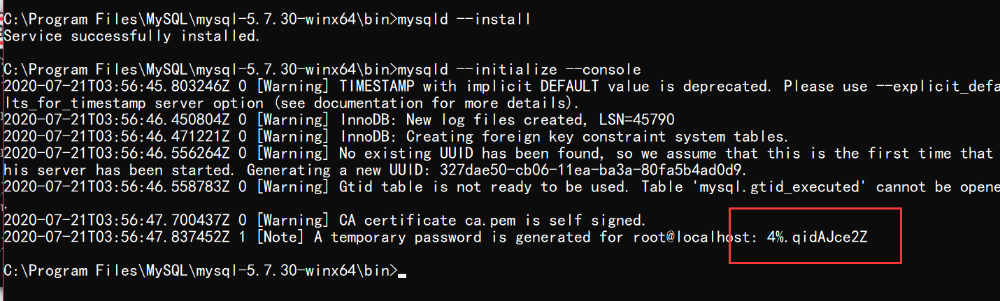
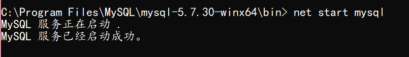
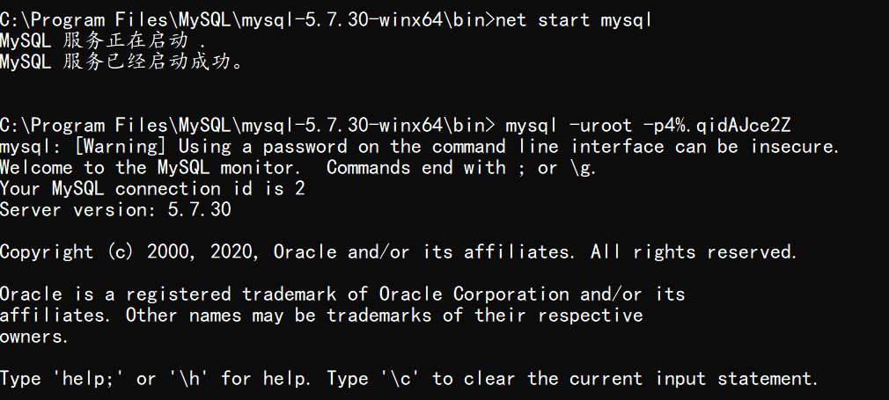

# win10-MySQL5.7 安装与配置

##   安装

> 官网下载zip

[mysql](https://downloads.mysql.com/archives/community/):https://downloads.mysql.com/archives/community/

> 解压到任意你想安装的目录

ps:不要用中文目录

## 配置

> 安装mysql服务

- CMD以管理员打开,切换到mysql安装目录 

- 执行命令:mysql --install

  

> 初始化mysql

- 初始化会生成一个随机密码，这里需要记住这个密码，方便之后登录mysql进行修改。

- 初始化命令

- mysqld --initialize --console

  

> 启动mysql服务

- 登录mysql之前,需要启动之前安装的服务
- 命令: net start mysql

> 登录

- 这时登录名为root,密码为刚才随机生成的密码
- 命令: mysql -uroot -p

*出错解决方案*

1. 首先,停止mysql服务:net stop mysql
2. 然后启动重新登录

***ps:实际上第一次登录时就应该加上随机生成的密码***

>  修改密码

- 命令 :alter user 'root'@'localhost' identified by 'xxxx';
- 然后退出重新登录

到这里,mysql5.7的安装与配置已经完成.

然后就可以用MysqlFront这类数据库管理软件登录了

## 设置全局变量

右键此电脑👉点击左侧高级系统设置👉点击最下面的环境变量👉下面系统变量中找到path👉点击下面的编辑按钮👉点击右侧新建👉将mysql的bin目录地址复制进去(C:\Program Files\MySQL\mysql-5.7.30-winx64\bin)

