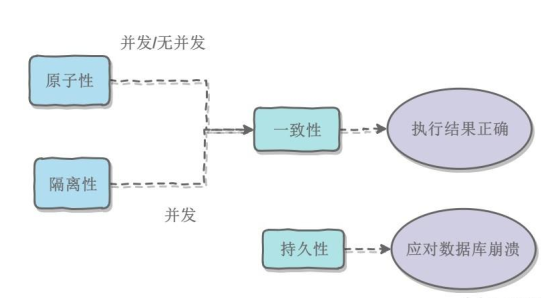
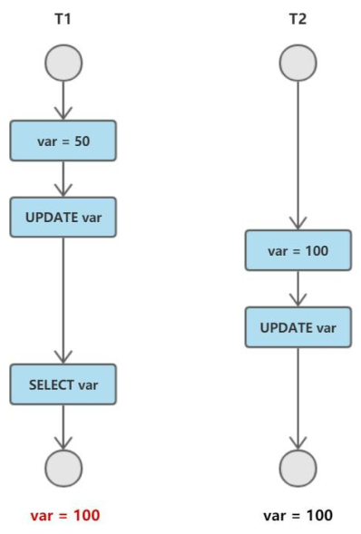
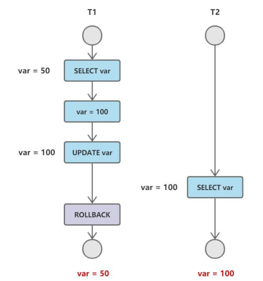
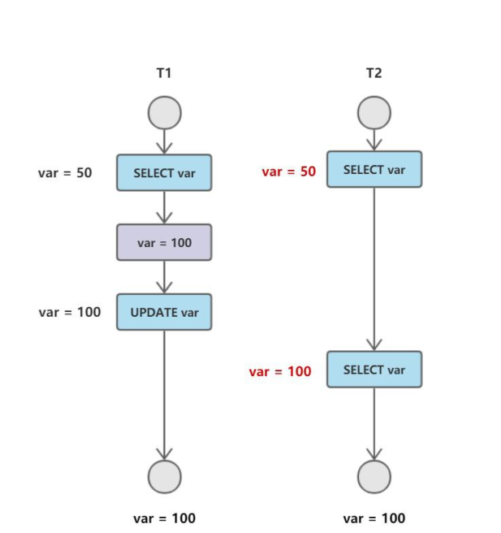
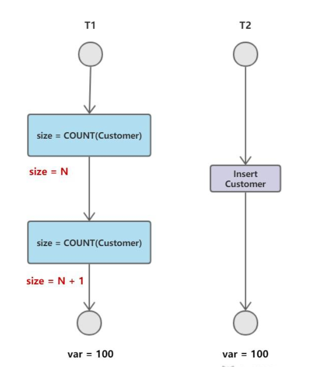
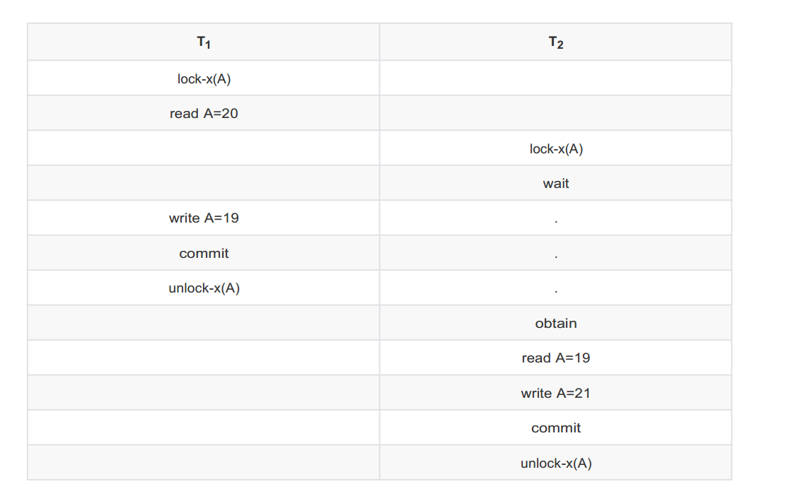
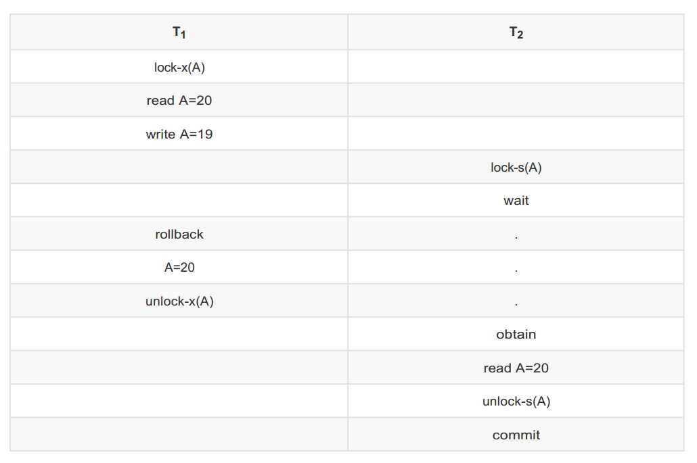
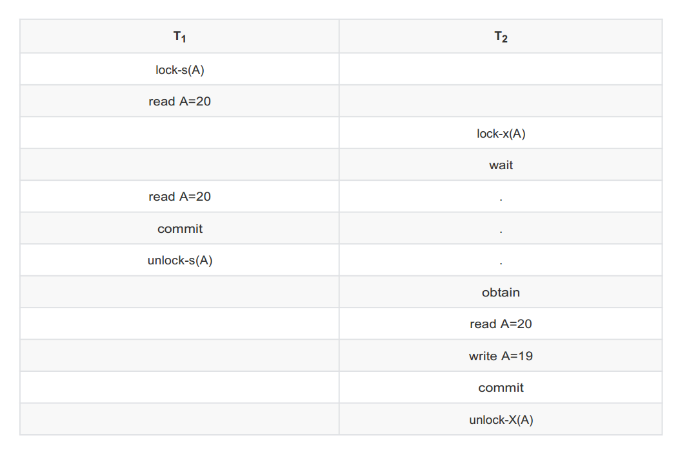

# 一、数据库系统原理

## （一）事务

### 概念

一组满足acid特性的操作，可以通过commit提交一个事务，也可以使用rollback进行回滚

### ACID

**原子性（Atomicity）**

事务被视为不可分割的最小单元，事务的所有操作，要么全部提交成功，要么全部失败回滚

回滚可以用回滚日志来实现，回滚日志记录着事务所之行的修改操作，在回滚时反向执行修改操作即可。

**一致性（Consistency）**

数据库在事务执行前后都保持一致性，在一致性状态下，所有事物对一个数据的读取结果都是相同的。

**隔离性（Isolation)**

一个事务所作的修改在最终提交以前，对其他事务是不可见的。

**持久性（Durability）**

一旦事务提交，则其所做的所有修改都将存储在数据库中。即使系统崩溃，事务执行的结果也不能丢失。使用重做日志来保证其持久性。

> 事物的ACIF概念简单，但是需要注意，这几个特性不是一种平级关系

- 只有满足一致性，事务的执行结果才是正确的。
- 在无并发的情况下，事务串行执行，隔离性一定能够满足。此时只要满足原子性，就一定能满足一致性。
- 在并发的情况下，多个事务并行执行，事务不仅要满足原子性，还需要满足隔离性，才能满足一致性。
- 实务满足持久化是为了能应对数据库崩溃的情况。




### AUTOCOMMIT	

MySQL 默认采用自动提交模式。也就是说，如果不显式使用`start transaction`语句来开始一个事务，那么整个查询都会当做一个事务提交。

## （二）并发一致性问题


在并发环境下，事物的隔离性很难保证，因此会出现很多并发一致性问题。

### 丢失修改

T1和T2两个事物都对一个数据进行修改，T1先修改，T2随后修改，T2的修改覆盖了T1的修改。



### 读脏数据

T2修改一个数据，T2随后读取这个数据。如果T1撤销了这次修改，那么T2读取的数据就是脏数据。



### 不可重复读

T2读取一个数据，T1对该数据进行了修改。如果T2再次读取这个数据，此时读取的结果和第一次读取的结果不同。



### 幻影读

T1读取某个范围的数据，T2在这个范围内插入新的数据，T1再次读取这个范围的数据，此时读取的结果和第一次读取的结果不同。



> ps:产生并发不一致性问题主要原因是破坏了事务的隔离性，解决方法是通过并发控制来保证隔离性。并发控制可以通过封锁来实现，但是封锁操作需要用户自己操作，相当复杂。数据库管理系统提供了事物的隔离级别，让用户以一种更轻松的方式处理并发一致性问题。

## （三）封锁

### 封锁粒度

MySQL中提供了两种封锁粒度：行级锁、表级锁

因该尽量只锁定需要修改的部分数据，而不是所有的资源。锁定的数据量越小，发生锁争用的概率越小，系统的并发程度越高。

但是加锁需要消耗资源，所的各种操作（包括获取锁、释放锁、以及检查锁状态）都会增加系统开销。因此封锁粒度越小，系统开销就越大。

在选择封锁粒度时，需要在锁开销和并发程度之间做一个权衡。

### 封锁类型

#### 1.读写锁

- 排它锁（Exclusive），简称X锁，又称写锁。
- 共享锁（Share），简称S锁，又称读锁。

> 有两个规定

- 一个事务对数据对象A加了X锁，就可以对A进行读取和更新。加锁期间其他事务不能对A加任何锁。
- 一个事务对数据对象A加了S锁，可以对A进行读取操作，但是不能进行更新操作。加锁期间其他事务能对A加S锁，但是不能加X锁。

锁的兼容关系：

|  ·   |  X   |  S   |
| :--: | :--: | :--: |
|  X   |  ✖   |  ✖   |
|  S   |  ✖   |  ✔   |

#### 2.意向锁

使用意向锁（Intention Locks）可以更容易地支持多粒度封锁。

在存在行级锁和表级锁的情况下，事务T想要对表A加X锁，就要先检测是否有其他事务对表A或者表A中的一行加了锁，那就需要对表A中的每一行进行检测，太耗时。

意向锁在原来的X/S锁的基础上引入了IX、IS锁，这俩都是表锁，用来表示一个事务是否想要在表中的某个数据行上加上X锁或者S锁。

> 两个规定

- 一个事务在获得数据行对象的S锁之前，必须获得IS锁或更强的锁。
- 一个事务在获得数据行对象的X锁之前，必须获得IX锁或更强的锁。

通过引入意向锁，事务T想要对表A加X锁，只需要先检测是否有事务对此表加了S、IS、X 、IX锁，如果加了就表示有其他事务正在使用这个表或者表中某一行,因此事务T加X锁失败。

> 锁的兼容关系

|  .   | X    | IX   | S    | IS   |
| :--: | ---- | ---- | ---- | ---- |
|  X   | ✖    | ✖    | ✖    | ✖    |
|  IX  | ✖    | ✔    | ✖    | ✔    |
|  S   | ✖    | ✖    | ✔    | ✔    |
|  IS  | ✖    | ✔    | ✔    | ✔    |

> - 任意IS、IX锁之间都是兼容的，他们只是想要加锁，而不是真正地加锁
> - S锁只于S、IS锁兼容。

### 封锁协议

#### 一级封锁协议

事务T要修改数据A时必须加X锁，直到T结束才释放锁。

可以解决丢失修改问题，因为不能同时有两个事物对同一数据进行修改，那么事物的修改就不会被覆盖。



#### 二级封锁协议

在一级的基础上，要求读取数据A时必须加S锁，读取完马上释放S锁。

可以解决读脏数据的问题，因为如果一个事务在对数据A进行修改，根据一级封锁协议，会加X锁，那么就不能再加S锁了，也就是不能读脏数据。



#### 三级封锁协议

在二级的基础上，要求读取数据A时必须加S锁，直到事务结束了才能释放S锁。

可以解决不可重复读的问题，因为读A时，其他事务不能对A加X锁，从而避免了在读的期间数据发生改变。



#### 两段锁协议

加锁和解锁分两段执行。

可串行化调度是指，通过并发控制，使得并发执行的事务结果与某个串行执行的事务结果相同。

事务遵循两段锁协议是保证可串行化调度的充分条件。

例如

```
lock-x(A)...lock-x(B)...lock-x(C)...unlock-x(A)...unlock-x(B)...unlock-x(C)
```

这个满足两段锁协议，它是可串行化调度。

但不是必要条件

例如

```
lock-x(A)...unlock-x(A)...lock-x(B)...unlock-x(B)...lock-x(C)...unlock-x(C)	
```

这个不满足两段锁协议，但它还是可串行化调度。

#### MySQL隐式与显式锁定

MySQL的InnoDB存储引擎采用两段锁协议，会根据隔离级别在需要的时候自动加锁，并且所有的锁都是在同一时刻被释放，这就叫做隐式锁定。

InnoDB也可以用特性的语句进行显示锁定：

```sql
select ... lock in share mode;
select ... for update;
```

## （四）隔离级别

### 未提交读（READ UNCOMMITTED）

事务中的修改，即使没有提交，其他事务也是可见的。

### 提交读（READ COMMITTED）

一个事务只能读取已提交的事务所作的修改。也就是说一个事务所作的修改在未提交之前都是不可见的。

### 可重复读（REPEATABLE READ）

保证在同一事务中，多次读取同一数据是一致的。

### 可串行化（SERIALIZABLE）

强制事务串行执行。

需要加锁实现，其他隔离层级通常不需要。

| 隔离级别 | 脏读 | 不可重复读 | 幻影读 |
| -------- | ---- | ---------- | ------ |
| 未提交读 | ✔    | ✔          | ✔      |
| 提交读   | ✖    | ✔          | ✔      |
| 可重复读 |      |            |        |
| 可串行化 |      |            |        |

