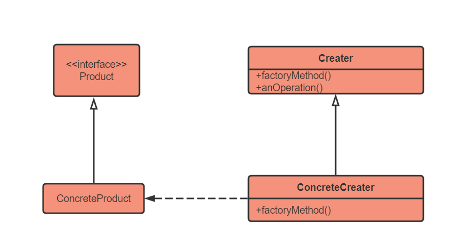
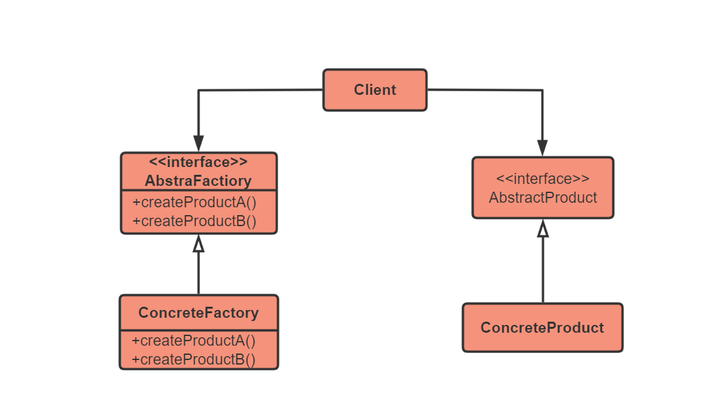
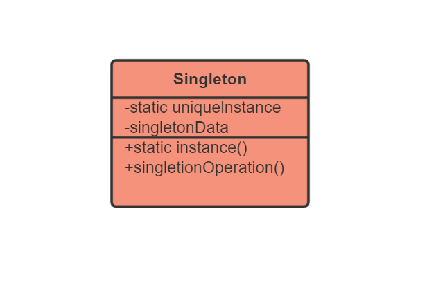

## 设计原则

###  单一职责原则

不要存在多与一个导致类变更的原因

总结: 一个类只负责一项职责

###  里氏替换原则

1. 子类可以实现父类的抽象方法,但不能覆盖父类的非抽象方法

2. 子类可以有自己独有的方法

3. 当子类的方法重载父类的方法时,方法的前置条件(方法的形参)要比父类方法的输入参数更宽松

4. 当子类的方法实现父类的抽象方法时,方法的后置条件(方法的返回值)要比父类更严格

   总结 : 所有引用父类的地方必须能透明地地使用其子类对象

###  依赖倒置原则/ 面向接口编程

高层模块不应该依赖低层模块,二者都不应该依赖他的抽象;

抽象不依赖细节,细节应该依赖抽象.

### 接口隔离原则

使用专门的借口来替代综合的大接口

一个类对另一个类的依赖应该建立在最小的接口上

### 迪米特法则

一个类对自己的依赖的类知道的越少越好。

被依赖的类，尽量将逻辑封装在内部。

### 开闭原则

对扩展开放，对修改关闭。

用抽象构建轮廓框架，用扩展去实现细节。

### 合成复原原则/组合优于继承

尽量多使用组合和聚合，尽量少使用甚至不使用继承关系。

组合举例：人和人的手

聚合举例：人和人的电脑

### 分类

| 创建型模式5  | 工厂方法模式、抽象工厂模式、单例模式、建造者模式、原型模式   |
| :----------- | ------------------------------------------------------------ |
| 结构型模式7  | 适配器模式、装饰器模式、代理模式、外观模式、桥接模式、组合模式、享元模式 |
| 行为型模式11 | 策略模式、模板方法模式、观察者模式、迭代其模式、责任链模式、命令模式、备忘录模式、状态模式、中介者模式、解释器模式。 |

## 创建型设计模式

### 工厂方法模式

#### 简单说说

工厂模式分为简单（静态）工厂模式、工厂方法模式、和抽象工厂模式

1. 工厂类角色：这是本模式的核心，含有一定的商业逻辑和判断逻辑。在Java中它往往有一个具体的类来体现。
2. 抽象产品角色：它一般是具体产品继承的父类或者实现的接口。在Java中由接口或者抽象类来体现。
3. 具体产品角色：工厂类所创建的对象就是此角色的实例。在java中由一个具体类实现。

- 简单工厂模式： 一个类处于对产品实例化调用的中心位置上，它决定那一个产品类应当被实例化。
- 工厂方法模式：
  - 一个抽象产品类，可以派生出多个具体产品类。
  - 一个抽象工厂类，可以派生出多个具体工厂类。
  - 每个具体工厂类只能创建一个具体产品的实例。

#### **UML**

#### 适用场景与优缺点

适用场景：

1. 客户不需要知道要使用的对象的创建过程
2. 客户使用对象存在变动的可能，或者根本就不知道使用哪一个具体对象

缺点：类的数量膨胀，需要太多类

### 抽象方法模式

#### 简单说说

抽象工厂模式：

- 多个抽象产品类，每个抽象产品类可以派生出多个具体产品类。
- 一个抽象工厂类，可以派生出多个具体工厂类。
- 每个具体工厂类可以创建多个具体产品类的实例

区别： 

- 工厂方法模式只有一个抽象产品类,而抽象工厂模式有多个
- 工厂方法模式的具体工厂类只能创建一个具体产品类的实例，而抽象工厂模式可以创建多个。

#### UML

#### 适用场景与优缺点

适用场景：

1. 系统中有多个产品族，而系统一次只能消费其中一族产品
2. 同属于一个产品族的产品一起使用

###  单例模式

#### 简单说说

通过单例模式可以保证系统中，应用该模式的类一个类只有一个实例。即一个类只有一个对象实例

#### UML

#### 适用场景与优缺点

适用场景：

1. 当类只有一个实例且客户可以从一个众所周知的访问点 访问他
2.  当这个唯一实例应该是通过子类化可扩展的，且客户应该无序更改代码就能使用一个扩展的实例

优点：

1. 队惟一实例的受控访问
2. 缩小命名空间，避免命名污染
3. 允许单例有子类
4. 允许可变数目的实例